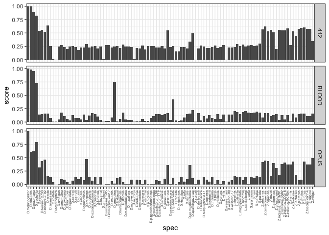
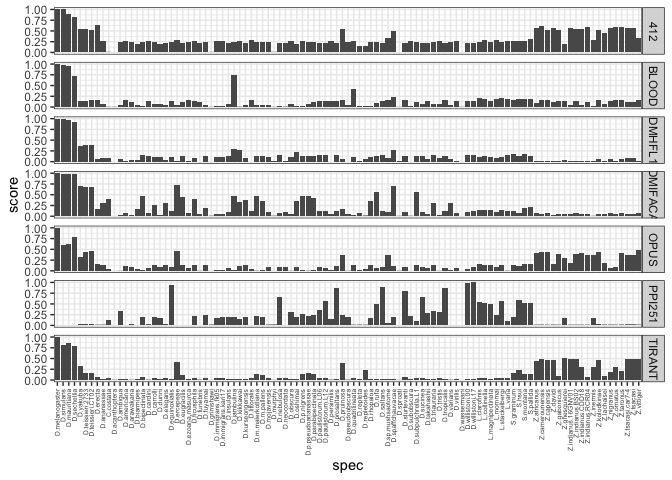

Origin of the TEs
================

# Question

Which Drosophila species is the origin of blood, opus, 412. Since I
address this question already for three TEs, I will extend it to all
Dmel TEs.

# Genomes and RepeatMasking

``` bash
# ask Florian
```

## Result

A merged RepeatMasker file for i) all Dmel TEs and ii) all 101 genomes.
A small sample

``` bash
[0,7949]rokofler%head 101genomes_allTEs.ori.out
   277 25.72 0.00 1.43             contig_1     25830     25900 (34454495) C              BAGGINS     Unspecified  (1149)    4304    4235       C.costata.fasta.ori.out
   256 29.38 2.03 3.42             contig_1     32698     32845 (34447550) +                 INE1     Unspecified      29     174   (437)       C.costata.fasta.ori.out
   386 24.96 8.23 3.64             contig_1     64622     64779 (34415616) +                 INE1     Unspecified      10     174   (437)       C.costata.fasta.ori.out
   390 24.29 11.33 1.21             contig_1     69836     69985 (34410410) C                 INE1     Unspecified   (437)     174      10      C.costata.fasta.ori.out
   246 25.58 17.05 0.00             contig_1     70505     70633 (34409762) +                 INE1     Unspecified      24     174   (437)      C.costata.fasta.ori.out
   253 30.12 0.94 2.88             contig_1     91229     91334 (34389061) +               M14653     Unspecified    1021    1124   (162)       C.costata.fasta.ori.out
   681 31.65 2.03 2.03             contig_1    108573    108917 (34371478) C               DMCR1A     Unspecified   (447)    4023    3679       C.costata.fasta.ori.out
  1083 33.64 6.45 1.20             contig_1    109194    109906 (34370489) C               DMCR1A     Unspecified   (916)    3554    2805       C.costata.fasta.ori.out
   243 31.82 0.00 0.00             contig_1    110247    110334 (34370061) C               DMCR1A     Unspecified  (2018)    2452    2365       C.costata.fasta.ori.out
   246 27.41 11.85 0.00             contig_1    110417    110551 (34369844) +                 INE1     Unspecified      24     174   (437)      C.costata.fasta.ori.out
```

# Processing

Run script on repeat-masked 101 genomes; it finds for each TE family the
highest-scoring RM HSP and than normalizes all HSPs to this one
(given\_HSP/max\_HSP). For each species it again finds the higest of
these ratios. Basically this gives for each species and TE the best
match to the consensus sequence of Dmel.

``` bash
python process-101genomes.py --rm 101genomes_allTEs.ori.out > te-species-score.txt 
```

# Visualiszing

``` r
library(tidyverse)
```

    ## ── Attaching packages ─────────────────────────────────────── tidyverse 1.3.1 ──

    ## ✔ ggplot2 3.3.6     ✔ purrr   0.3.4
    ## ✔ tibble  3.1.7     ✔ dplyr   1.0.9
    ## ✔ tidyr   1.2.0     ✔ stringr 1.4.0
    ## ✔ readr   2.1.2     ✔ forcats 0.5.1

    ## ── Conflicts ────────────────────────────────────────── tidyverse_conflicts() ──
    ## ✖ dplyr::filter() masks stats::filter()
    ## ✖ dplyr::lag()    masks stats::lag()

``` r
theme_set(theme_bw())

h<-read.table("/Users/rokofler/analysis/dmel_TE_invasions/2023-04-origin-101-genomes-ro/te-species-score-cleaned.txt",header=F)
names(h)<-c("te","species","score")
h$spec<-str_replace(h$species,".fasta.ori.out","")
h$spec <- factor(h$spec, levels=c("D.melanogaster", "D.simulans", "D.mauritiana", "D.sechellia", 
"D.yakuba", "D.teissieri.2733", "D.teissieri.CT02", "D.erecta", 
"D.ananassae", "C.costata", "D.acanthoptera", "D.ambigua", "D.americana", 
"D.arawakana", "D.biarmipes", "D.bipectinata", "D.cardini", "D.carrolli", 
"D.dunni", "D.elegans", "D.equinoxialis", "D.ercepeae", "D.eugracilis", 
"D.ezoana.masurca", "D.ficusphila", "D.funebris", "D.fuyamai", 
"D.grimshawi", "D.immigrans.fk05", "D.immigrans.kari17", "D.insularis", 
"D.jambulina", "D.kikkawai", "D.kurseongensis", "D.littoralis", 
"D.m.malerkotliana", "D.m.pallens", "D.mojavensis", "D.murphyi", 
"D.nebulosa", "D.neocordata", "D.obscura", "D.oshimai", "D.p.nigrens", 
"D.p.pseudoananassae", "D.parabipectinata", "D.paulistorum.L06", 
"D.paulistorum.L12", "D.persimilis", "D.prosaltans", "D.pruinosa", 
"D.pseudoobscura", "D.quadrilineata", "D.repleta", "D.repletoides", 
"D.rhopaloa", "D.rufa", "D.saltans", "D.sp.mushsaotome", "D.spaffchauvacae", 
"D.sproati", "D.sturtevanti", "D.subobscura", "D.subpulchrella.L1", 
"D.sucinea", "D.takahashii", "D.triauraria", "D.tristis", "D.tropicalis", 
"D.varians", "D.virilis", "D.wassermani", "D.willistoni.00", 
"D.willistoni.17", "L.clarofinis", 
"L.collinella", "L.magnipectinata", "L.mommai", "L.stackelbergi", 
"L.varia", "S.graminum", "S.hsui", "S.montana", "S.pallida", 
"Z.africanus", "Z.camerounensis", "Z.capensis", "Z.davidi", "Z.gabonicus", 
"Z.ghesquierei", "Z.indianus.16GNV01", "Z.indianus.BS02", "Z.indianus.CDD18", 
"Z.indianus.RCR04", "Z.inermis", "Z.kolodkinae", "Z.lachaisei", 
"Z.nigranus", "Z.ornatus", "Z.taronus", "Z.tsacasi.car7-4", "Z.tsacasi", 
"Z.vittiger"))

t<-subset(h,te %in% c("OPUS","412","BLOOD"))

p<- ggplot(t,aes(y=score,x=spec))+geom_bar(stat="identity")+facet_grid(te~.)+
  theme(axis.text.x = element_text(angle = 90, vjust = 0.5, hjust=1,size=5))
plot(p)
```

<!-- -->

``` r
t<-subset(h,te %in% c("PPI251","DMHFL1","DMIFACA","TIRANT","OPUS","412","BLOOD"))

p<- ggplot(t,aes(y=score,x=spec))+geom_bar(stat="identity")+facet_grid(te~.)+
  theme(axis.text.x = element_text(angle = 90, vjust = 0.5, hjust=1,size=5))
plot(p)
```

<!-- -->
