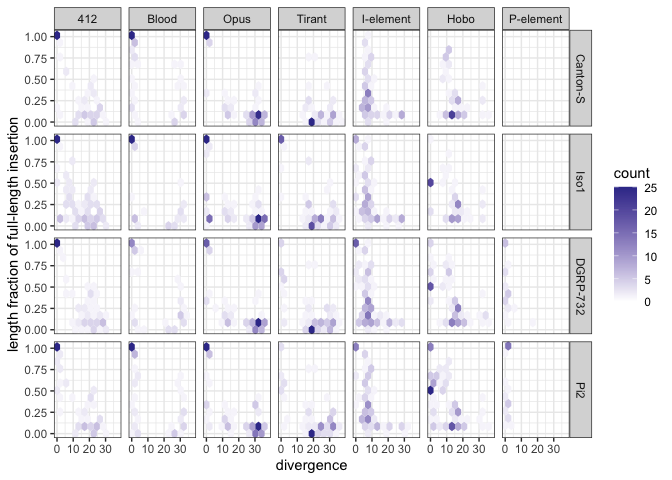

Old fragmented copies
================

# which assemblies

``` bash
md5 *fasta                                                                                                                                              
MD5 (Canton-S.fasta) = 4b60ff2ee57267a22585bd86bb614781
MD5 (DGRP-732.fasta) = b1d5cc5a6a8f8e9be435d66d7b99b2e5
MD5 (Iso1.fasta) = db53fe4735abe68d6caf8d8ee5d0e10e
MD5 (Oregon-R.fasta) = 612e225c236129d9f6f15cc8ccd825b6
MD5 (Pi2.fasta) = 761f82144798cbdb1da0ff40e866d365
MD5 (SZ244.fasta) = 0426240259ecfa931f6f6e29c48fdd45
MD5 (SZ45.fasta) = 2731029f2c78a6fd2face83807cc0761
```

# Repeat Masking

``` bash
for i in *.fa; do RepeatMasker -pa 20 -no_is -s -nolow -dir out -lib repeatlibrary/teseqs.fasta  $i;done  
```

Defragment files

``` bash
for i in *ori.out; do python ../info/rm-defragmenter.py --rm $i --fai ../info/teseqs.fasta.fai --dist 100 > ../raw-defrag/$i.def; done
```

Append file name and merge

``` bash
awk '{print $0,FILENAME}' *.ori.out.def|perl -pe 's/\.fasta\.ori\.out\.def//' > merged.def   
```

# Visualize

``` r
#  RT1C X_RaGOO +   1243825 1244687 10.6474314214   802 5443 Canton-S
#  RT1C X_RaGOO +   20257895    20259126    12.0255913978   1302    5443 Canton-S
#  RT1C X_RaGOO +   20267696    20268986    11.9096513353   1348    5443 Canton-S
library(tidyverse)
```

    ## ── Attaching packages ─────────────────────────────────────── tidyverse 1.3.1 ──

    ## ✔ ggplot2 3.3.6     ✔ purrr   0.3.4
    ## ✔ tibble  3.1.7     ✔ dplyr   1.0.9
    ## ✔ tidyr   1.2.0     ✔ stringr 1.4.0
    ## ✔ readr   2.1.2     ✔ forcats 0.5.1

    ## ── Conflicts ────────────────────────────────────────── tidyverse_conflicts() ──
    ## ✖ dplyr::filter() masks stats::filter()
    ## ✖ dplyr::lag()    masks stats::lag()

``` r
theme_set(theme_bw())

h<-read.table("/Users/rokofler/analysis/dmel_TE_invasions/2023-05-five-dmel/raw-defrag/merged.def",header=F)
names(h)<-c("te","chr","strand","start","end","div","fraglen","telen","sample")
h$lenfraction <- h$fraglen / h$telen
# https://ggplot2.tidyverse.org/reference/geom_hex.html
h<-subset(h,fraglen>200)
h<-subset(h,sample %in% c("Canton-S","DGRP-732","Iso1","Pi2")) # only high quality assemblies; Oregon-R is contaminated with the P-element; Chakraborty is informed
h$sample<-factor(h$sample, levels=c("Canton-S", "Iso1", "DGRP-732", "Pi2"))
tmuseum<-subset(h,te %in% c("OPUS","BLOOD","412"))
tall<-subset(h,te %in% c("PPI251","DMHFL1","DMIFACA","TIRANT","OPUS","412","BLOOD"))
tall$te<-factor(tall$te, levels=c("412","BLOOD","OPUS", "TIRANT", "DMIFACA","DMHFL1","PPI251"))
levels(tall$te) <- c('412', 'Blood', 'Opus',"Tirant","I-element","Hobo","P-element")

p <- ggplot(tall, aes(div, lenfraction)) + geom_hex(bins=10)+facet_grid(sample~te)+
  scale_fill_gradient2(limits = c(0, 25), oob = scales::squish)+xlab("divergence")+ylab("length fraction of full-length insertion")
plot(p)
```

<!-- -->

``` r
pdf(file="/Users/rokofler/analysis/dmel_TE_invasions/2023-05-five-dmel/graphs/all-separate.pdf",width=8,height=5)
plot(p)
dev.off()
```

    ## quartz_off_screen 
    ##                 2
