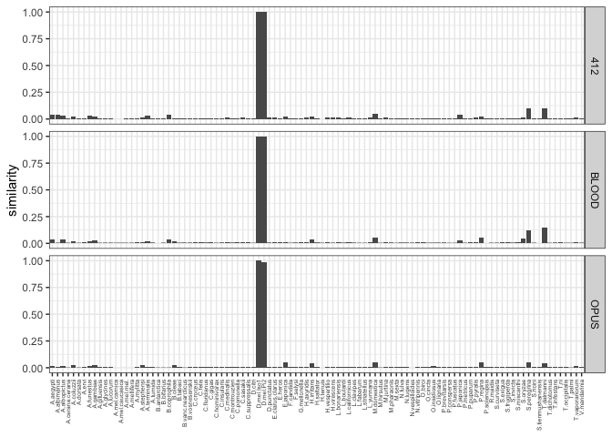
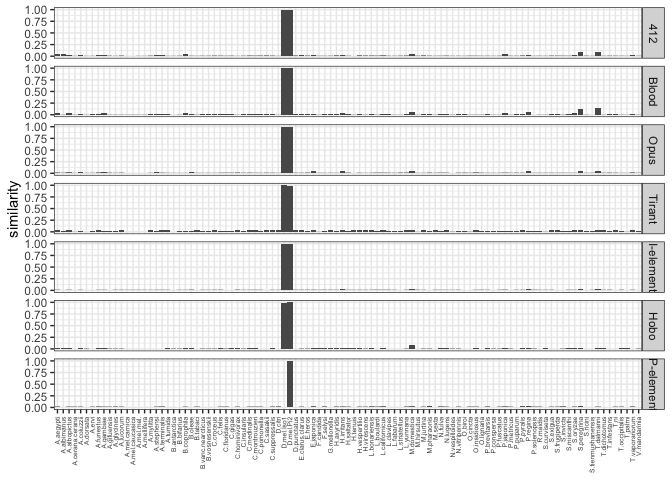

Origin of the TEs - visualization
================

# Compute the score for each TE and each species

``` bash
python process-101genomes.py --rm raw/merged.fa.ori.out >te-species-score-otherspecies.txt
```

# Visualize

## lets start with the three new ones: 412,opus,blood

``` r
library(tidyverse)
```

    ## ── Attaching packages ─────────────────────────────────────── tidyverse 1.3.1 ──

    ## ✔ ggplot2 3.3.6     ✔ purrr   0.3.4
    ## ✔ tibble  3.1.7     ✔ dplyr   1.0.9
    ## ✔ tidyr   1.2.0     ✔ stringr 1.4.0
    ## ✔ readr   2.1.2     ✔ forcats 0.5.1

    ## ── Conflicts ────────────────────────────────────────── tidyverse_conflicts() ──
    ## ✖ dplyr::filter() masks stats::filter()
    ## ✖ dplyr::lag()    masks stats::lag()

``` r
theme_set(theme_bw())

h<-read.table("/Users/rokofler/analysis/dmel_TE_invasions/2023-05-otherspecies-ro/te-species-score-otherspecies.txt",header=F)
names(h)<-c("te","species","score")

# the three new ones
t<-subset(h,te %in% c("OPUS","412","BLOOD"))

p<- ggplot(t,aes(y=score,x=species))+geom_bar(stat="identity")+facet_grid(te~.)+ylab("similarity")+
  theme(axis.title.x=element_blank(),
        axis.text.x = element_text(angle = 90, vjust = 0.5, hjust=1,size=5))


plot(p)
```

<!-- -->

``` r
# all invaders
t<-subset(h,te %in% c("PPI251","DMHFL1","DMIFACA","TIRANT","OPUS","412","BLOOD"))
t$te<-factor(t$te, levels=c("412","BLOOD","OPUS", "TIRANT", "DMIFACA","DMHFL1","PPI251"))
levels(t$te) <- c('412', 'Blood', 'Opus',"Tirant","I-element","Hobo","P-element")

p<- ggplot(t,aes(y=score,x=species))+geom_bar(stat="identity")+facet_grid(te~.)+ylab("similarity")+
  theme(axis.title.x=element_blank(),axis.text.x = element_text(angle = 90, vjust = 0.5, hjust=1,size=5))
plot(p)
```

<!-- -->

``` r
pdf(file="/Users/rokofler/analysis/dmel_TE_invasions/2023-05-otherspecies-ro/graphs/origin-otherspecies.pdf",width=7,height=7)
plot(p)
dev.off()
```

    ## quartz_off_screen 
    ##                 2
