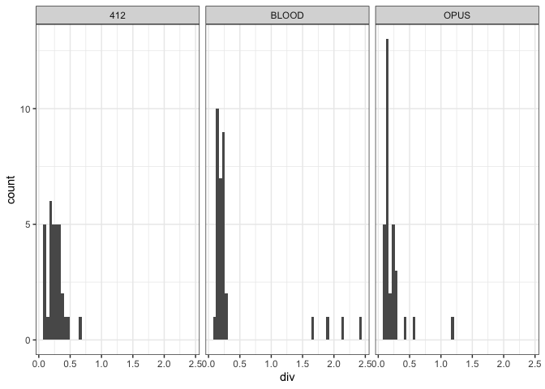
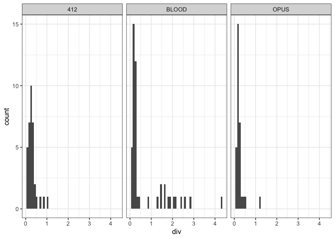

extract sequences of old-fragmented copies
================

# which assemblies

``` bash
md5 *fasta                                                                                                                                    
MD5 (Canton-S.fasta) = 4b60ff2ee57267a22585bd86bb614781
MD5 (DGRP-732.fasta) = b1d5cc5a6a8f8e9be435d66d7b99b2e5
MD5 (Oregon-R.fasta) = 612e225c236129d9f6f15cc8ccd825b6
# check on my personal computer after sftp
MD5 (Canton-S.fasta) = 4b60ff2ee57267a22585bd86bb614781
MD5 (DGRP-732.fasta) = b1d5cc5a6a8f8e9be435d66d7b99b2e5
MD5 (Oregon-R.fasta) = 612e225c236129d9f6f15cc8ccd825b6
```

# Repeat Masking

``` bash
# done for the 2D heatmaps
for i in *.fa; do RepeatMasker -pa 20 -no_is -s -nolow -dir out -lib repeatlibrary/teseqs.fasta  $i;done  


# check ori.out of RepeatMasker in my folder after sftp
MD5 (Canton-S.fasta.ori.out) = efefc56d419e0a9bb4d31ad1ebd6a05e
MD5 (DGRP-732.fasta.ori.out) = c21d0ac87aaa2540bd1357bf3c327bf3
MD5 (Oregon-R.fasta.ori.out) = 429355e66e90acaf2ea9c113f68c62b7
```

Merge fragmented entries: merger

``` bash
[0,9658]rokofler%python rm-merger.py --fai raw-seq/teseqs.fasta.fai --dist 100 --rm raw-out/Canton-S.fasta.ori.out > raw-merged/Canton-S.merged
[0,9659]rokofler%python rm-merger.py --fai raw-seq/teseqs.fasta.fai --dist 100 --rm raw-out/Oregon-R.fasta.ori.out > raw-merged/Oregon-R.merged 
[0,9660]rokofler%python rm-merger.py --fai raw-seq/teseqs.fasta.fai --dist 100 --rm raw-out/DGRP-732.fasta.ori.out > raw-merged/DGRP-732.merged 

# head raw-merged/Canton-S.merged
# TE  chrm    strand start  end qstart  qend  divergence  qlen  telen
RT1C    X_RaGOO +   1243825 1244687 1416    2978    10.6505542169   1563    5443
RT1C    X_RaGOO +   20257895    20259126    3633    5442    11.8975162866   1810    5443
RT1C    X_RaGOO +   20267696    20268986    3577    5442    11.8008641005   1866    5443
RT1C    X_RaGOO +   20534849    20536607    2118    5441    6.8440880139    3324    5443
RT1C    X_RaGOO +   20542524    20544260    2118    5443    6.88831460674   3326    5443
RT1C    X_RaGOO +   20550157    20551886    2118    5443    6.64923668639   3326    5443
RT1C    X_RaGOO +   20557756    20559482    2118    5443    6.65180794309   3326    5443
RT1C    X_RaGOO +   20565436    20567161    2118    5441    6.59995848161   3324    5443
RT1C    X_RaGOO +   21359755    21359787    4528    4560    3.03    33  5443
RT1C    X_RaGOO +   21360095    21361153    1   5443    12.7008860759   5443    5443
```

# Visualize Canton-S

``` r
library(tidyverse)
```

    ## ── Attaching packages ─────────────────────────────────────── tidyverse 1.3.1 ──

    ## ✔ ggplot2 3.3.6     ✔ purrr   0.3.4
    ## ✔ tibble  3.1.7     ✔ dplyr   1.0.9
    ## ✔ tidyr   1.2.0     ✔ stringr 1.4.0
    ## ✔ readr   2.1.2     ✔ forcats 0.5.1

    ## ── Conflicts ────────────────────────────────────────── tidyverse_conflicts() ──
    ## ✖ dplyr::filter() masks stats::filter()
    ## ✖ dplyr::lag()    masks stats::lag()

``` r
theme_set(theme_bw())

h<-read.table("/Users/rokofler/analysis/dmel_TE_invasions/2023-11-reviewer-degraded/raw-merged/Canton-S.merged",header=F)
names(h)<-c("te","chr","strand","start","end","qstart","qend","div","fraglen","telen")
h$lenfraction <- h$fraglen / h$telen
h<-subset(h,te %in% c("BLOOD","OPUS","412")) 

tp<-subset(h,fraglen>6000 & div <5)
p <- ggplot(tp, aes(x=div))+geom_histogram(bins=50)+facet_grid(.~te)
plot(p)
```

<!-- -->

``` r
tp<-subset(h,fraglen>100 & div <5)
p <- ggplot(tp, aes(x=div))+geom_histogram(bins=50)+facet_grid(.~te)
plot(p)
```

<!-- -->

Extract fragments

``` bash
cat Canton-S.merged |awk '$1=="OPUS" || $1=="BLOOD"|| $1=="412"' | awk '$8>1.5 && $9>100' > old-fragments-cantons
# generate - bed
cat old-fragments-cantons|awk 'BEGIN{OFS="\t"}{print $2,$4,$5,$1 "_" NR}' > old-fragments.bed
# extract sequences
reader-fasta.py raw-seq/Canton-S.fasta |fasta-subseq-fasta.py --bed raw-merged/old-fragments.bed |fasta-writter.py > old-fragments/Cantons-fragments.fasta
# get hierachy
cat raw-merged/old-fragments.bed|awk '{print $4 "\t" $4}'|perl -pe 's/_(\d)+$//' |awk '{print $1 "\t" $2 "_anc\tLTR" }' >old-fragments/Cantons-fragments.hier  
# in the hierachy, generate a distinct category for the special Blood
# cat Canton-S.merged|awk '$1=="BLOOD" && $8<5 && $8>1.5 && $9>6000'
#BLOOD  X_RaGOO C   26018450    26025559    1   7269    2.40710796013   7269    7410
#BLOOD  3R_RaGOO    +   3235949 3242942 1   7129    1.91953728984   7129    7410
#BLOOD  3R_RaGOO    C   3191734 3198491 377 7267    1.66142347166   6891    7410
#BLOOD  3R_RaGOO    C   3417640 3424656 1   7267    2.1289491827    7267    7410

# X_RaGOO   26018450    26025559    BLOOD_197
# 3R_RaGOO  3235949 3242942 BLOOD_204
# 3R_RaGOO  3191734 3198491 BLOOD_208
# 3R_RaGOO  3417640 3424656 BLOOD_210
```
