2023_05_09_Invasions_1800_analysis
================
Almo

Setting the environment

``` r
library(tidyverse)
theme_set(theme_bw())
```

``` r
df_0 <- read.csv("/Volumes/INTENSO/merged/CSV/GDL_ols_museum.csv", header = FALSE)
names(df_0) <- c("run_accession","TE", "All_reads", "HQ_reads")
```

``` r
#Removing single copy genes used for the normalization
df_1 <- df_0 %>%
  dplyr::filter(!(TE %in% c("Dmel_tj", "Dmel_rpl32", "Dmel_rhi")))


df_metadata <- read.table("/Users/ascarpa/Downloads/dataset-metadata.txt", sep = "\t", header = TRUE)

df_2 <- inner_join(df_1, df_metadata, by = "run_accession") 

#Removing non Dmel TEs, they only map low quality reads
df <- df_2 %>%
  dplyr::filter(!grepl("^DM|^DV|^DNTOMRETA", TE))


df_museum <- subset(df, study == "museum")


museum_1800 <- df_museum %>%
  dplyr::filter(estimated_year == 1800) %>%
  dplyr::group_by(TE) %>%
  dplyr::summarize(avg_TE_all = mean(All_reads),
            avg_TE_HQ = mean(HQ_reads))
names(museum_1800) <- c("TE","avg_1800_all", "avg_1800_HQ")


museum_1933 <- df_museum %>%
  dplyr::filter(estimated_year == 1933) %>%
  dplyr::group_by(TE) %>%
  dplyr::summarize(avg_TE = mean(All_reads),
            avg_TE_HQ = mean(HQ_reads))
names(museum_1933) <- c("TE","avg_1933_all", "avg_1933_HQ")

museum_difference <- inner_join(museum_1800, museum_1933, by ="TE")
museum_difference$diff_all <- (museum_difference$avg_1933_all-museum_difference$avg_1800_all)
museum_difference$diff_norm_all <- (museum_difference$avg_1933_all-museum_difference$avg_1800_all)/museum_difference$avg_1933_all
museum_difference$diff_HQ <- (museum_difference$avg_1933_HQ-museum_difference$avg_1800_HQ)
museum_difference$diff_norm_HQ <- (museum_difference$avg_1933_HQ-museum_difference$avg_1800_HQ)/museum_difference$avg_1933_HQ


sorted_museum_difference_all <- museum_difference %>%
  dplyr::arrange(desc(diff_norm_all)) %>%
  dplyr::slice(1:10)
print(sorted_museum_difference_all)
```

    ## # A tibble: 10 × 9
    ##    TE       avg_1800_all avg_1800_HQ avg_1933_all avg_1933_HQ diff_all
    ##    <chr>           <dbl>       <dbl>        <dbl>       <dbl>    <dbl>
    ##  1 412           0.737       0.238         51.0      28.1     50.2    
    ##  2 OPUS          1.30        0.0383        43.1      20.8     41.8    
    ##  3 BLOOD         3.05        1.32          25.2      14.1     22.2    
    ##  4 TIRANT        0.125       0.0167         0.832     0.332    0.708  
    ##  5 AF056940      0.00167     0              0.01      0        0.00833
    ##  6 ISBU1         0.125       0.00333        0.361     0.01     0.236  
    ##  7 KEPLER       20.7         0.0133        42.7       0.00812 22.0    
    ##  8 G2           16.1         5.49          28.5      13.3     12.3    
    ##  9 SGM           0.0183      0              0.03      0        0.0117 
    ## 10 G6_DM        10.0         3.83          15.8       7.72     5.78   
    ## # … with 3 more variables: diff_norm_all <dbl>, diff_HQ <dbl>,
    ## #   diff_norm_HQ <dbl>

``` r
sorted_museum_difference_HQ <- museum_difference %>%
  dplyr::arrange(desc(diff_norm_HQ)) %>%
  dplyr::slice(1:10)
print(sorted_museum_difference_HQ)
```

    ## # A tibble: 10 × 9
    ##    TE      avg_1800_all avg_1800_HQ avg_1933_all avg_1933_HQ diff_all
    ##    <chr>          <dbl>       <dbl>        <dbl>       <dbl>    <dbl>
    ##  1 OPUS           1.30      0.0383        43.1       20.8      41.8  
    ##  2 412            0.737     0.238         51.0       28.1      50.2  
    ##  3 TIRANT         0.125     0.0167         0.832      0.332     0.708
    ##  4 BLOOD          3.05      1.32          25.2       14.1      22.2  
    ##  5 ISBU1          0.125     0.00333        0.361      0.01      0.236
    ##  6 TARTYAK        0.952     0.01           1.30       0.0269    0.348
    ##  7 G2            16.1       5.49          28.5       13.3      12.3  
    ##  8 GYPSY12        7.25      1.14          10.9        2.42      3.62 
    ##  9 GTWIN          2.73      0.858          4.15       1.75      1.42 
    ## 10 G6_DM         10.0       3.83          15.8        7.72      5.78 
    ## # … with 3 more variables: diff_norm_all <dbl>, diff_HQ <dbl>,
    ## #   diff_norm_HQ <dbl>

``` r
gg_different_TEs_all <- ggplot(sorted_museum_difference_all, aes(x = TE, y = diff_all))+ 
  geom_bar(stat = "identity", color='skyblue',fill='steelblue')+
  labs(title = "All reads - Difference between 1800 and 1933 in the museum samples")+
  xlab("TE") +
  ylab("Difference in copy number")+
  coord_cartesian(xlim = c(1, 10))
plot(gg_different_TEs_all)
```

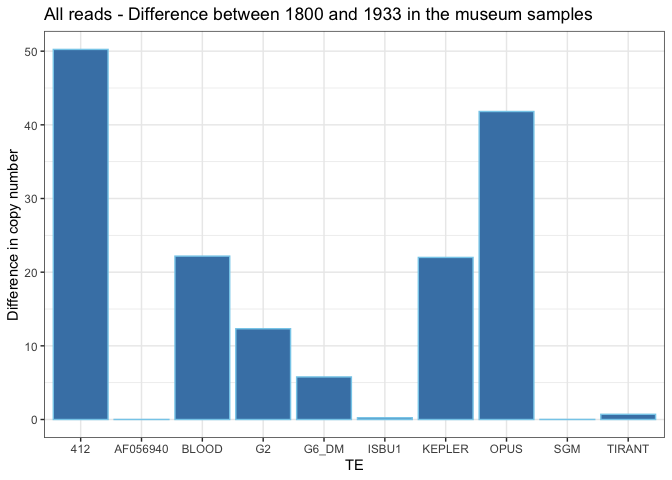<!-- -->

``` r
gg_different_TEs_HQ <- ggplot(sorted_museum_difference_HQ, aes(x=TE, y=diff_HQ))+ 
  geom_bar(stat = "identity", color='skyblue',fill='steelblue')+
  labs(title = "HQ reads - Difference between 1800 and 1933 in the museum samples")+
  xlab("TE") +
  ylab("Difference in copy number")+
  coord_cartesian(xlim = c(1, 10))
plot(gg_different_TEs_HQ)
```

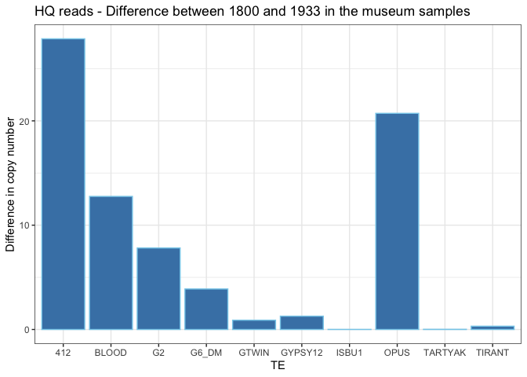<!-- -->

``` r
df_museum_412 <- subset(df, study == "museum" & TE == "412")
gg_412_all <- ggplot(df_museum_412, aes(x=as.factor(estimated_year), y=All_reads)) + 
  geom_boxplot() +
  labs(title = "412 all reads")+
  xlab("Estimated year") +
  ylab("Copy number")
plot(gg_412_all)
```

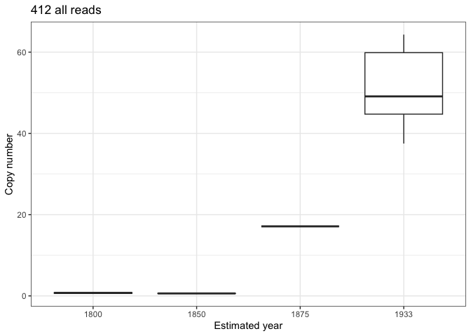<!-- -->

``` r
gg_412_HQ <- ggplot(df_museum_412, aes(x=as.factor(estimated_year), y=HQ_reads)) + 
  geom_boxplot() +
  labs(title = "412 HQ reads")+
  xlab("Estimated year") +
  ylab("Copy number")
plot(gg_412_HQ)
```

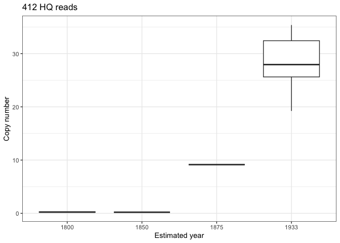<!-- -->

``` r
df_museum_BLOOD <- subset(df, study == "museum" & TE == "BLOOD")
gg_BLOOD_all <- ggplot(df_museum_BLOOD, aes(x=as.factor(estimated_year), y=All_reads)) + 
  geom_boxplot() +
  labs(title = "BLOOD all reads")+
  xlab("Estimated year") +
  ylab("Copy number")
plot(gg_BLOOD_all)
```

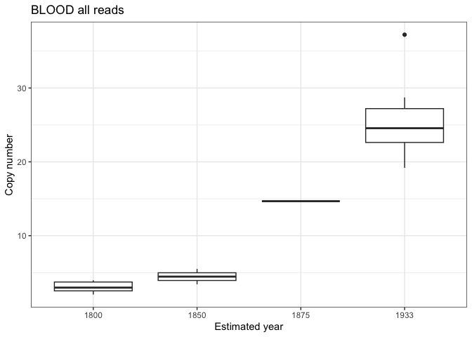<!-- -->

``` r
gg_BLOOD_HQ <- ggplot(df_museum_BLOOD, aes(x=as.factor(estimated_year), y=HQ_reads)) + 
  geom_boxplot() +
  labs(title = "Blood HQ reads")+
  xlab("Estimated year") +
  ylab("Copy number")
plot(gg_BLOOD_HQ)
```

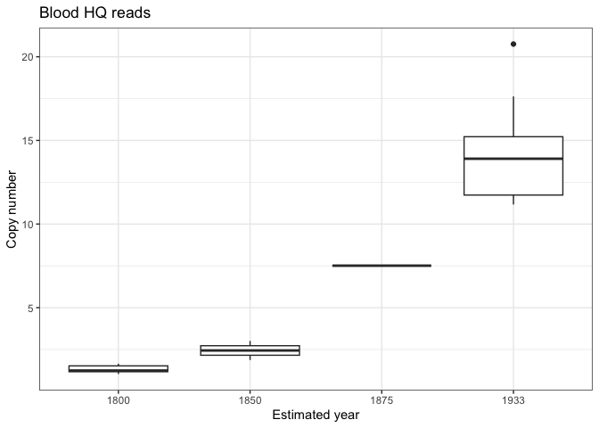<!-- -->

``` r
df_museum_OPUS <- subset(df, study == "museum" & TE == "OPUS")
gg_OPUS_all <- ggplot(df_museum_OPUS, aes(x=as.factor(estimated_year), y=All_reads)) + 
  geom_boxplot() +
  labs(title = "OPUS all reads")+
  xlab("Estimated year") +
  ylab("Copy number")
plot(gg_OPUS_all)
```

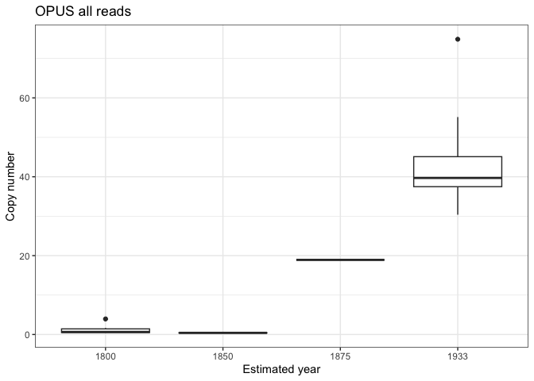<!-- -->

``` r
gg_OPUS_HQ <- ggplot(df_museum_OPUS, aes(x=as.factor(estimated_year), y=HQ_reads)) + 
  geom_boxplot() +
  labs(title = "OPUS HQ reads")+
  xlab("Estimated year") +
  ylab("Copy number")
plot(gg_OPUS_HQ)
```

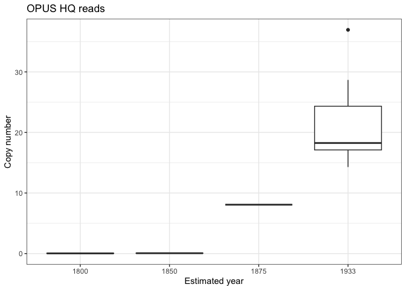<!-- -->

``` r
df_museum_TIRANT <- subset(df, study == "museum" & TE == "TIRANT")
gg_OPUS_all <- ggplot(df_museum_TIRANT, aes(x=as.factor(estimated_year), y=All_reads)) + 
  geom_boxplot() +
  labs(title = "TIRANT all reads")+
  xlab("Estimated year") +
  ylab("Copy number")
plot(gg_OPUS_all)
```

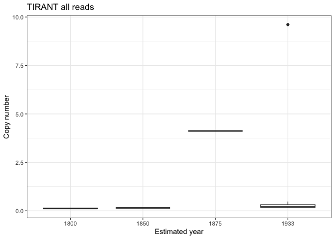<!-- -->

``` r
gg_OPUS_HQ <- ggplot(df_museum_TIRANT, aes(x=as.factor(estimated_year), y=HQ_reads)) + 
  geom_boxplot() +
  labs(title = "TIRANT HQ reads")+
  xlab("Estimated year") +
  ylab("Copy number")
plot(gg_OPUS_HQ)
```

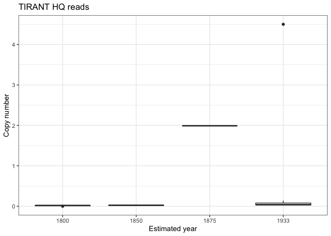<!-- -->

``` r
df_museum_GYPSY2 <- subset(df, study == "museum" & TE == "GYPSY2")
gg_OPUS_all <- ggplot(df_museum_GYPSY2, aes(x=as.factor(estimated_year), y=All_reads)) + 
  geom_boxplot() +
  labs(title = "GYPSY2 all reads")+
  xlab("Estimated year") +
  ylab("Copy number")
plot(gg_OPUS_all)
```

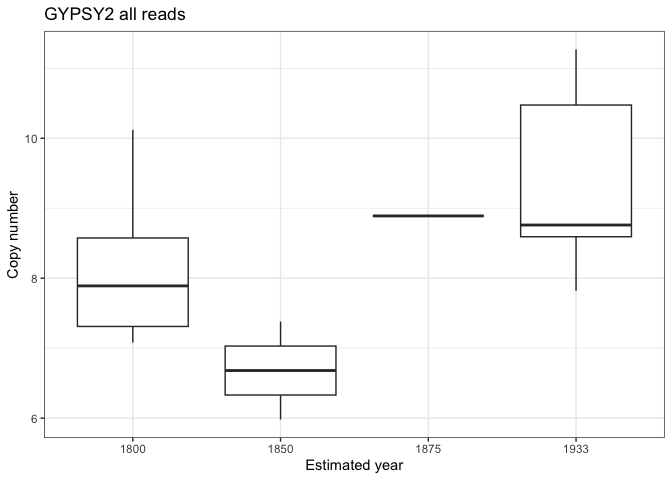<!-- -->

``` r
gg_GYPSY_HQ <- ggplot(df_museum_GYPSY2, aes(x=as.factor(estimated_year), y=HQ_reads)) + 
  geom_boxplot() +
  labs(title = "GYPSY HQ reads")+
  xlab("Estimated year") +
  ylab("Copy number")
plot(gg_GYPSY_HQ)
```

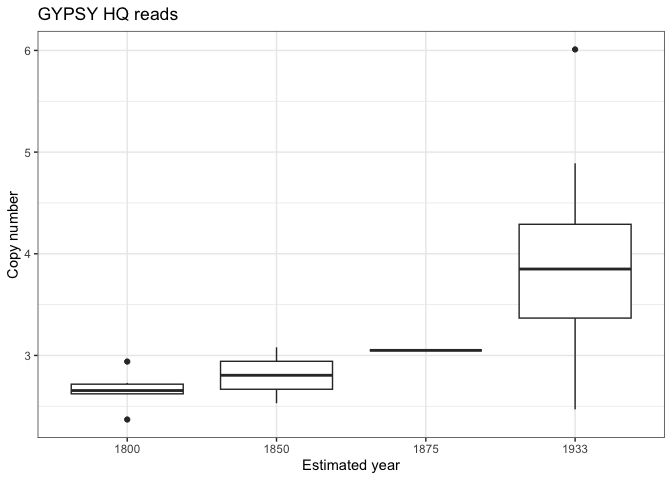<!-- -->

``` r
df_museum_KEPLER <- subset(df, study == "museum" & TE == "KEPLER")
gg_KEPLER_all <- ggplot(df_museum_KEPLER, aes(x=as.factor(estimated_year), y=All_reads)) + 
  geom_boxplot() +
  labs(title = "KEPLER all reads")+
  xlab("Estimated year") +
  ylab("Copy number")
plot(gg_KEPLER_all)
```

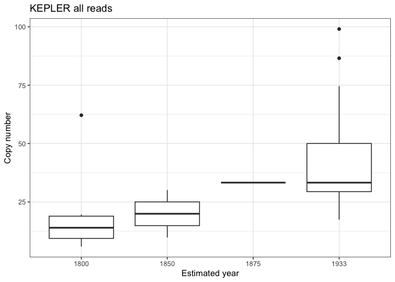<!-- -->

``` r
gg_KEPLER_HQ <- ggplot(df_museum_KEPLER, aes(x=as.factor(estimated_year), y=HQ_reads)) + 
  geom_boxplot() +
  labs(title = "KEPLER HQ reads")+
  xlab("Estimated year") +
  ylab("Copy number")
plot(gg_KEPLER_HQ)
```

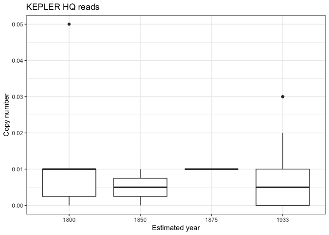<!-- -->
