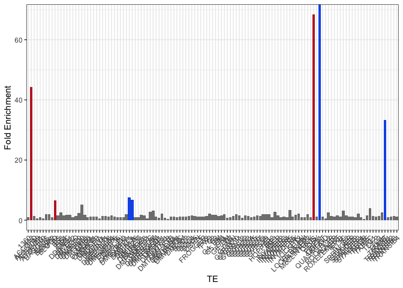
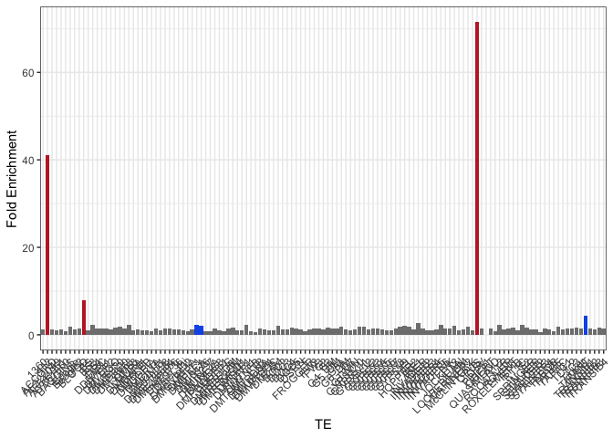
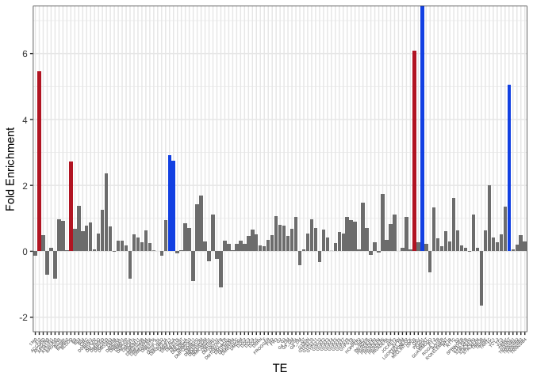
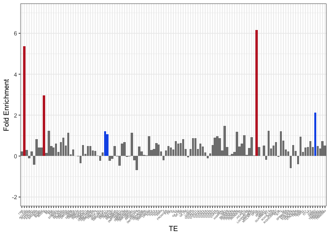
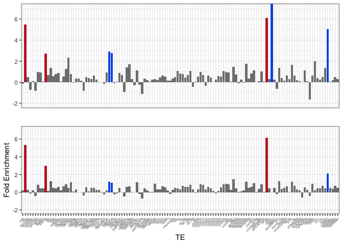
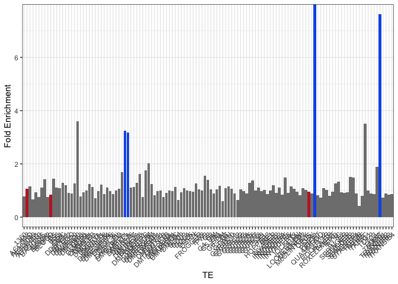
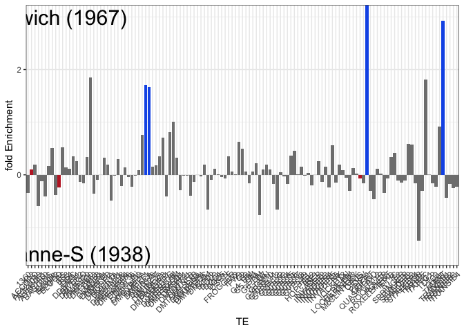
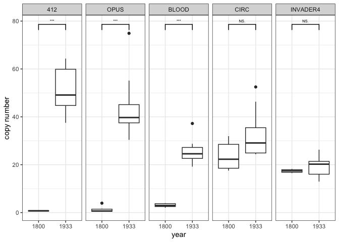
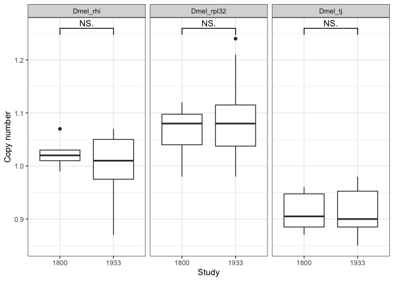

2023_05_10_1800_vs_1933
================
Almorò Scarpa

Setting the environment

``` r
library(tidyverse)
library(writexl)
library(ggpubr)
theme_set(theme_bw())
```

``` r
df_0 <- read.csv("/Volumes/INTENSO/merged/CSV/GDL_ols_museum.csv", header = FALSE)
names(df_0) <- c("run_accession","TE", "All_reads", "HQ_reads")


df_metadata <- read.table("/Users/ascarpa/Downloads/dataset-metadata.txt", sep = "\t", header = TRUE)

df_2 <- inner_join(df_0, df_metadata, by = "run_accession") 


df_museum_1800 <- subset(df_2, run_accession == "SRR23876582")
df_Harwich <- subset(df_2, run_accession == "SRR11846560")
df_Lausanne_S <- subset(df_2, run_accession == "SRR11846564")
```

### Cleaning the dataset

I only keep TEs present in D. Harwich, this would not show lost TEs but
I checked and there are no TEs lost. I also remove some TEs because we
are using all the reads, but this can cause misleading reasults if the
reads map on a single part of the TE, like streteches of As in the
LINEs, the removed TEs are picked after a screening of the
deviaTE_plots.

``` r
df_filtering <- df_Harwich %>%
  filter(All_reads>1) %>%
  select("TE")

df_filtering <- df_filtering %>%
  filter(!(TE %in% c("DV26847", "KEPLER", "Q", "TARTVIR", "TARTYAK")))
```

### Comparison of strains from different time periods

``` r
df_museum_1800 <- inner_join(df_museum_1800, df_filtering, by = "TE")
df_Harwich <- inner_join(df_Harwich, df_filtering, by = "TE")
df_Lausanne_S <- inner_join(df_Lausanne_S, df_filtering, by = "TE")

df_museum_1800 <- df_museum_1800 %>%
  select(TE, All_reads)
df_Harwich <- df_Harwich %>%
  select(TE, All_reads)
df_Lausanne_S <- df_Lausanne_S %>%
  select(TE, All_reads)


df_m_Har <- inner_join(df_museum_1800, df_Harwich, by = "TE")
names(df_m_Har) <- c("TE", "copies_museum", "copies_Har")
df_m_Lau <- inner_join(df_museum_1800, df_Lausanne_S, by = "TE")
names(df_m_Lau) <- c("TE", "copies_museum", "copies_Lau")


df_m_Har$fold_enrichment <- df_m_Har$copies_Har/df_m_Har$copies_museum
df_m_Lau$fold_enrichment <- df_m_Lau$copies_Lau/df_m_Lau$copies_museum

df_m_Har$log_fold_enrichment <- log2(df_m_Har$fold_enrichment)
df_m_Lau$log_fold_enrichment <- log2(df_m_Lau$fold_enrichment)


red_c <- "#c1272d"
blue_c <- "#155BE8"
TEs_c <- c("412" = red_c, "BLOOD" = red_c, "OPUS" = red_c,"TIRANT" = blue_c, "DMHFL1" = blue_c, "DMIFACA" = blue_c, "PPI251" = blue_c)


#Figure 1A
ggplot(data = df_m_Har, aes(x = TE, y = fold_enrichment, fill = TE)) +
  geom_bar(stat = "identity", position = "dodge") +
  xlab("TE") +
  ylab("Fold Enrichment") +
  scale_fill_manual(values = TEs_c) +
  theme(legend.position = "none", axis.text.x = element_text(angle = 45, hjust = 1))
```

<!-- -->

``` r
ggplot(data = df_m_Lau, aes(x = TE, y = fold_enrichment, fill = TE)) +
  geom_bar(stat = "identity", position = "dodge") +
  xlab("TE") +
  ylab("Fold Enrichment") +
  scale_fill_manual(values = TEs_c) +
  theme(legend.position = "none", axis.text.x = element_text(angle = 45, hjust = 1))
```

<!-- -->

``` r
#Figure 1A log
gg_1A_log_Har <- ggplot(data = df_m_Har, aes(x = TE, y = log_fold_enrichment, fill = TE)) +
  geom_bar(stat = "identity", position = "dodge") +
  xlab("TE") +
  ylab("Fold Enrichment") +
  coord_cartesian(ylim = c(-2, 7))+
  scale_y_continuous(breaks = c(-2,0,2,4,6))+
  scale_fill_manual(values = TEs_c) +
  theme(legend.position = "none", axis.text.x = element_text(size = 4, angle = 45, hjust = 1))

plot(gg_1A_log_Har)
```

<!-- -->

``` r
gg_1A_log_Har_s <- gg_1A_log_Har + ylab("")+xlab("")+
  theme(axis.text.x = element_blank(),
        axis.ticks.x = element_blank())
ggsave("/Volumes/INTENSO/deviaTE_plots/Paper/Figure_1/Fig_1A_1.png", gg_1A_log_Har_s, width = 10, height = 4, dpi = 300)


gg_1A_log_Lau <- ggplot(data = df_m_Lau, aes(x = TE, y = log_fold_enrichment, fill = TE)) +
  geom_bar(stat = "identity", position = "dodge") +
  xlab("TE") +
  ylab("Fold Enrichment") +
  coord_cartesian(ylim = c(-2, 7))+
  scale_y_continuous(breaks = c(-2,0,2,4,6))+
  scale_fill_manual(values = TEs_c) +
  theme(legend.position = "none", axis.text.x = element_text(size = 4, angle = 45, hjust = 1))

plot(gg_1A_log_Lau)
```

<!-- -->

``` r
#Combined
gg_1A <- ggarrange(gg_1A_log_Har_s, gg_1A_log_Lau, ncol = 1, nrow = 2)
plot(gg_1A)
```

<!-- -->

``` r
#Figure check Harwich and Lousanne_S
df_Har_Lau <- inner_join(df_Harwich, df_Lausanne_S, by = "TE")
names(df_Har_Lau) <- c("TE", "copies_Har", "copies_Lau")
df_Har_Lau$fold_enrichment <- df_Har_Lau$copies_Har/df_Har_Lau$copies_Lau
df_Har_Lau$log_fold_enrichment <- log2(df_Har_Lau$fold_enrichment)

ggplot(data = df_Har_Lau, aes(x = TE, y = fold_enrichment, fill = TE)) +
  geom_bar(stat = "identity", position = "dodge") +
  xlab("TE") +
  ylab("Fold Enrichment") +
  scale_fill_manual(values = TEs_c) +
  theme(legend.position = "none", axis.text.x = element_text(angle = 45, hjust = 1))
```

<!-- -->

``` r
Har_Lau <- ggplot(data = df_Har_Lau, aes(x = TE, y = log_fold_enrichment, fill = TE)) +
  geom_bar(stat = "identity", position = "dodge") +
  ylab("fold Enrichment") +
  coord_cartesian(ylim = c(-1.5,3))+
  scale_y_continuous(breaks = c(-2,0,2))+
  annotate("text", x=9, y=3, label= "Harwich (1967)", size=8) +
  annotate("text", x=10.5, y=-1.5, label= "Lausanne-S (1938)", size=8) +
  scale_fill_manual(values = TEs_c) +
  theme(legend.position = "none", axis.text.x = element_text(angle = 45, hjust = 1))

plot(Har_Lau)
```

<!-- -->

``` r
#Figure 1C GDL test
df_museum <- df_2 %>%
  filter(study == "museum", estimated_year == 1800 | estimated_year == 1850)

#Check, expected output 8, 6 early and 2 mid samples
count <- df_museum %>% 
  filter(TE == "OPUS") %>% 
  summarize(count = n())
# Output the count
print(count)
```

    ##   count
    ## 1     8

``` r
df_GDL <- df_2 %>%
  filter(study == "gdl")

#Figure 1C
df_museum_a <- df_2 %>%
  filter(study == "museum", estimated_year == 1800 | estimated_year == 1933)

df_GDL_museum_8a_TEs <- subset(df_museum_a, TE == "412"|TE== "OPUS"|TE == "BLOOD"|TE =="CIRC"|TE =="INVADER4")

df_GDL_museum_8a_TEs$study <- factor(df_GDL_museum_8a_TEs$estimated_year, levels = c(1800, 1933))
df_GDL_museum_8a_TEs$TE <- factor(df_GDL_museum_8a_TEs$TE, levels = c("412", "OPUS","BLOOD","CIRC","INVADER4"))

fig_1C <- ggplot(df_GDL_museum_8a_TEs, aes(x = as.factor(estimated_year), y = All_reads)) +
  geom_boxplot() +
  geom_signif(comparisons = list(c("1800", "1933")), map_signif_level = TRUE, textsize = 2) +
  facet_wrap(~ TE, nrow = 1) +
  labs(x = "year", y = "copy number")

plot(fig_1C)
```

<!-- -->

### Sanity check on single copy genes

``` r
df_GDL_museum_8b_TEs <- subset(df_museum_a, TE=="Dmel_rhi"|TE=="Dmel_rpl32"|TE=="Dmel_tj")

df_GDL_museum_8b_TEs$study <- factor(df_GDL_museum_8b_TEs$estimated_year, levels = c(1800, 1933))

ggplot(df_GDL_museum_8b_TEs, aes(x = as.factor(estimated_year), y = All_reads)) +
  geom_boxplot() +
  geom_signif(comparisons = list(c("1800", "1933")), map_signif_level = TRUE) +
  facet_wrap(~ TE, nrow = 1) +
  labs(x = "Study", y = "Copy number")
```

<!-- -->

### Table for figure 2

-   1800 early: H10, H13
-   1800 mid: H9, H25
-   1800 late: H5
-   1933: H21, H24
-   Crimea
-   Lausanne-S
-   Urbana-S
-   Berlin-K
-   Dmel68
-   Harwich

``` r
TE_2 <- c("412", "OPUS", "BLOOD", "TIRANT", "DMIFACA", "DMHFL1", "PPI251")
samples_2 <- c("H10", "H13", "H9", "H25", "H5", "H21", "H24","Crimea", "Lausanne-S", "Urbana-S", "Berlin-K", "Dmel68", "Harwich")


df_fig2 <- df_2 %>%
  select(TE, sample, All_reads)%>%
  filter(TE %in% TE_2)%>%
  filter(sample %in% samples_2)

#Convert to wide format
table_fig2 <- df_fig2 %>%
  pivot_wider(names_from = sample, values_from = All_reads)

table_fig2_ordered <- table_fig2 %>%
  arrange(match(TE, TE_2)) %>%
  select(TE, all_of(samples_2))

table_fig2_ordered
```

    ## # A tibble: 7 × 14
    ##   TE      H10   H13    H9   H25    H5   H21   H24 Crimea `Lausanne-S` `Urbana-S`
    ##   <chr> <dbl> <dbl> <dbl> <dbl> <dbl> <dbl> <dbl>  <dbl>        <dbl>      <dbl>
    ## 1 412    0.82  0.95  0.55  0.66 17.1  64.3  48.6   46.7         39.1       39.2 
    ## 2 OPUS   0.52  0.49  0.38  0.44 18.9  74.9  51.9   30.6         35.0       39.6 
    ## 3 BLOOD  2.03  2.43  3.41  5.5  14.7  37.2  24.0   32.9         19.0       24.6 
    ## 4 TIRA…  0.12  0.16  0.15  0.15  4.12  0.44  0.48   0.65         0.7        2.82
    ## 5 DMIF…  8.4   8.01  7.97  9.43  9.84 12.4  11.6   16.4         16.9       19.6 
    ## 6 DMHF…  1.17  1.42  1.88  2.54  1.74  1.71  2.51   4.02         3.29       4.94
    ## 7 PPI2…  0     0     0     0     0     0     0      0            0          0   
    ## # … with 3 more variables: `Berlin-K` <dbl>, Dmel68 <dbl>, Harwich <dbl>

# Conclusions

Three LTR-retrotransposons invaded in the

century: 412, Opus and Blood.
