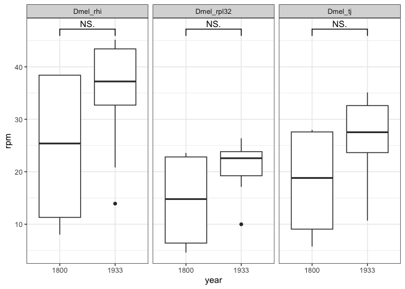

2023_05_23_PopulationTE2_rpm
================
Almorò Scarpa

Setting the environment

``` r
library(tidyverse)
library(writexl)
library(ggpubr)
theme_set(theme_bw())
```

``` r
df_0 <- read.csv("/Users/ascarpa/dmel_TE_invasions/Analysis/Pop2_reads.csv", header = TRUE)
df_0$rpm_tot <- (df_0$reads*1000000)/df_0$reads_in_file
df_0$rpm_map <- (df_0$reads*1000000)/df_0$reads_mapped


df_metadata <- read.table("/Users/ascarpa/dmel_TE_invasions/dataset-metadata", sep = "\t", header = TRUE)

df_1 <- inner_join(df_0, df_metadata, by = "run_accession") 


df_museum  <- df_1 %>%
  filter(study == "museum", estimated_year == 1800 | estimated_year == 1933)

df_GDL_museum_TEs <- subset(df_museum, te == "412"|te== "opus"|te == "blood"|te =="Circe"|te =="invader4")

df_GDL_museum_TEs$study <- factor(df_GDL_museum_TEs$estimated_year, levels = c(1800, 1933))

facet_order <- c("412", "blood", "opus", "Circe", "invader4")
df_GDL_museum_TEs$te <- factor(df_GDL_museum_TEs$te, levels = facet_order)


rpm_map <- ggplot(df_GDL_museum_TEs, aes(x = as.factor(estimated_year), y = rpm_map)) +
  geom_boxplot() +
  geom_signif(comparisons = list(c("1800", "1933")), map_signif_level = TRUE, textsize = 2) +
  facet_wrap(~ te, nrow = 1) +
  labs(x = "year", y = "rpm")

plot(rpm_map)
```

<!-- -->

``` r
#Sanity check on signle copy genes
df_GDL_museum_8b_TEs <- subset(df_museum, te=="Dmel_rhi"|te=="Dmel_rpl32"|te=="Dmel_tj")

df_GDL_museum_8b_TEs$study <- factor(df_GDL_museum_8b_TEs$estimated_year, levels = c(1800, 1933))

ggplot(df_GDL_museum_8b_TEs, aes(x = as.factor(estimated_year), y = rpm_tot)) +
  geom_boxplot() +
  geom_signif(comparisons = list(c("1800", "1933")), map_signif_level = TRUE) +
  facet_wrap(~ te, nrow = 1) +
  labs(x = "year", y = "rpm")
```

<!-- -->

The results are consistent if we use a different software and we
consider the row reads without normalization
