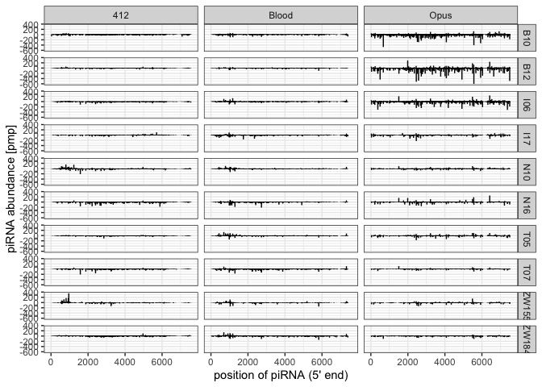

2023_05_30_piRNA_on_TEs
================
Almorò Scarpa

Setting the environment

``` r
library(tidyverse)
theme_set(theme_bw())
```

``` r
df <- read.table("/Volumes/INTENSO/piRNA/noadapt/bam/piRNAonTEsforR")
names(df) <- c("Run", "te","pos","pirna")
df <- subset(df, te=="412" | te=="BLOOD" |te=="OPUS")

metadata <- read.csv("/Volumes/INTENSO/piRNA/info/SraRunTable_piRNA.txt")
metadata <- metadata %>%
  select("Run", "Strain")

df<-inner_join(df, metadata, by = "Run")

ylow=min(df$pirna)
yhigh=max(df$pirna)

g_1 <- ggplot(df,aes(x=pos,y=pirna))+
  geom_segment(aes(xend=pos),yend=0)+
  ylim(ylow,yhigh)+
  ylab("piRNA abundance [pmp]")+
  xlab("position of piRNA (5' end)")+
  facet_grid( Strain ~ te, labeller = labeller(te = 
                                                 c("412" = "412",
                                                   "BLOOD" = "Blood",
                                                   "OPUS" = "Opus",
                                                   "CIRC" = "Circe",
                                                   "INVADER4" = "Invader-4")))

plot(g_1)
```

<!-- -->
