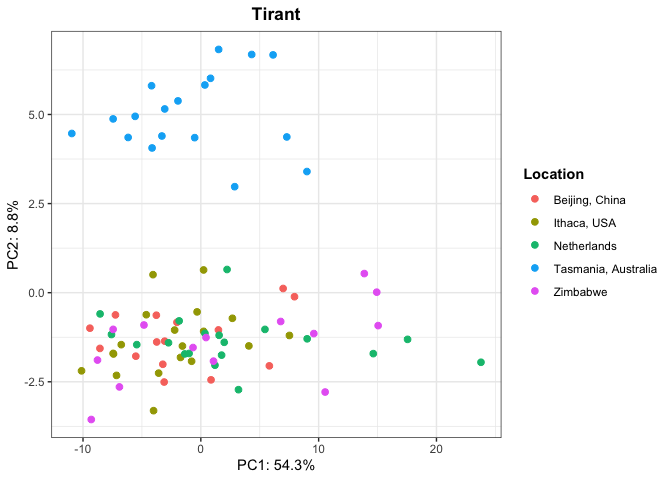
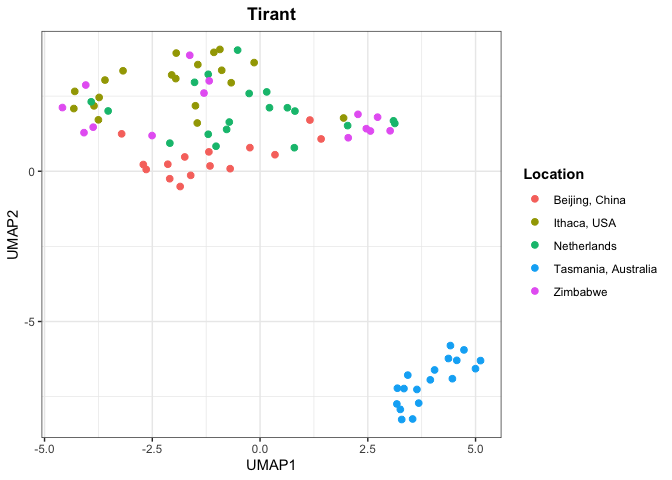
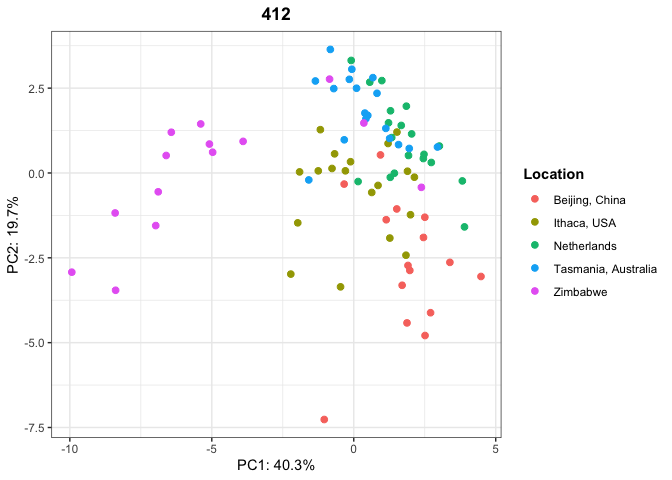
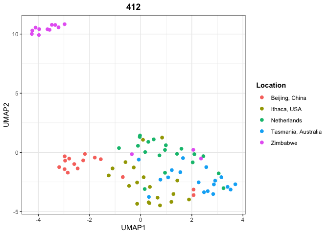
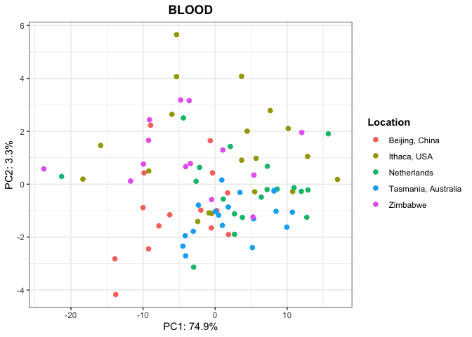
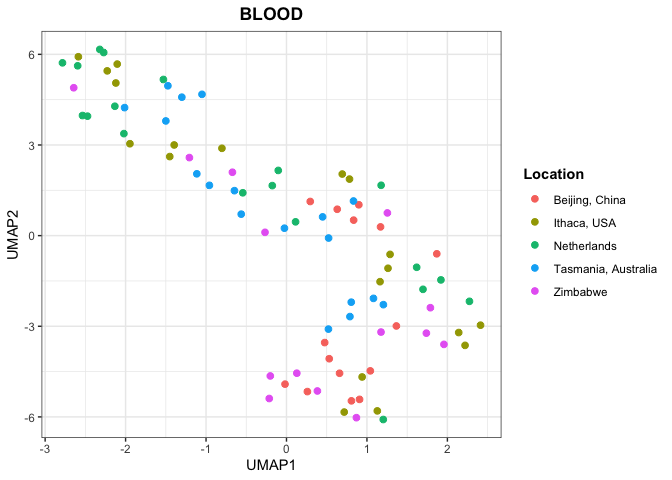
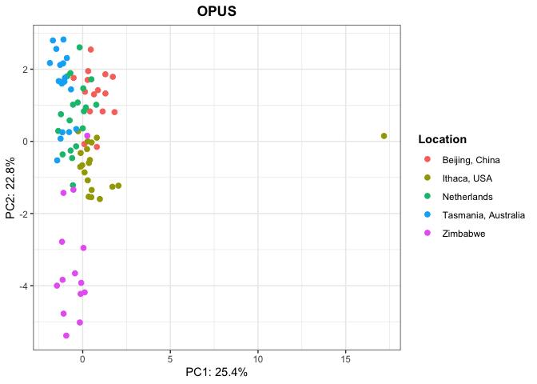
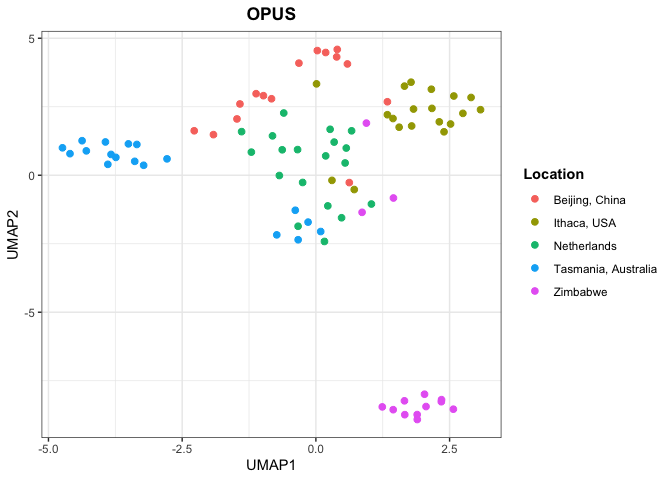
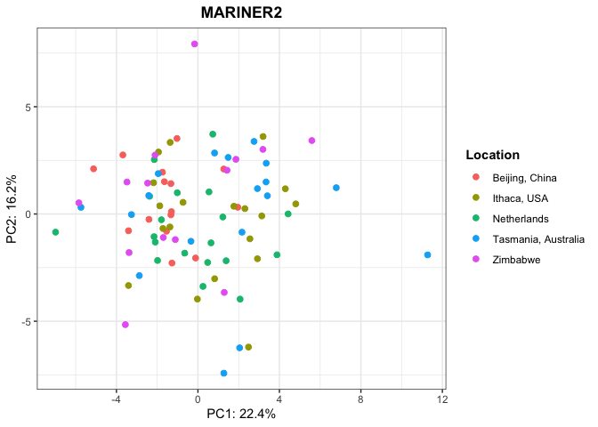
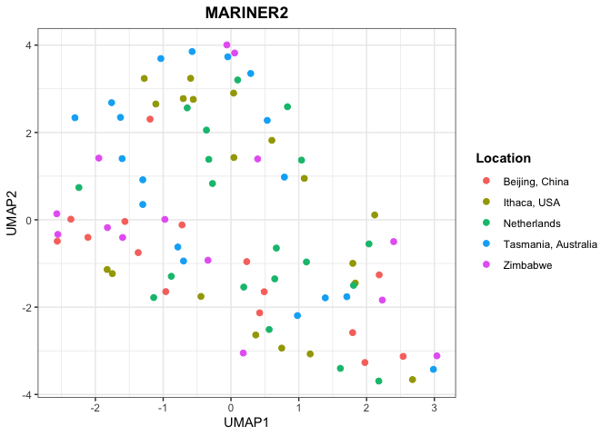

PCA-UMAP - Dmel Stealth Invasions
================

In this script I will try to detect any signal of population structure
in the sequences of the interesting TEs. To filter the SNPs, I used the
script *mpileup2PCA.py*.

## Filtering strategy

For a position to be selected as “SNP”, it must have at least 2 alleles
which are present in at least *n* samples with a frequency above *m*. In
the script, *n* and *m* are the two parameters to be specified as
arguments: **min-count** and **min-freq**.

The idea behind is to select only alleles which are present in a
relevant fraction of TE insertions in an individual (frequency
threshold), and these insertions with these alleles must be shared among
at least few individuals (to select population specific alleles).

## Metadata

For detecting population structure, we focus on **GDL** samples, cause
old samples without TEs are not interesting in this context and would
only hide potential structure within modern populations.

``` r
library(tidyverse)
```

    ## ── Attaching core tidyverse packages ──────────────────────── tidyverse 2.0.0 ──
    ## ✔ dplyr     1.1.1     ✔ readr     2.1.4
    ## ✔ forcats   1.0.0     ✔ stringr   1.5.0
    ## ✔ ggplot2   3.4.2     ✔ tibble    3.2.1
    ## ✔ lubridate 1.9.2     ✔ tidyr     1.3.0
    ## ✔ purrr     1.0.1     
    ## ── Conflicts ────────────────────────────────────────── tidyverse_conflicts() ──
    ## ✖ dplyr::filter() masks stats::filter()
    ## ✖ dplyr::lag()    masks stats::lag()
    ## ℹ Use the conflicted package (<http://conflicted.r-lib.org/>) to force all conflicts to become errors

``` r
library(ggpubr)
library(umap)

theme_set(theme_bw())

full_meta <- read_tsv("/Volumes/Temp1/Dmel-stealthTEs/dataset-metadata")
```

    ## Rows: 123 Columns: 8
    ## ── Column specification ────────────────────────────────────────────────────────
    ## Delimiter: "\t"
    ## chr (5): run_accession, sample, year, location, study
    ## dbl (3): lat, long, estimated_year
    ## 
    ## ℹ Use `spec()` to retrieve the full column specification for this data.
    ## ℹ Specify the column types or set `show_col_types = FALSE` to quiet this message.

``` r
meta <- full_meta %>% select(run_accession, location, study, estimated_year) %>% rename(ID = "run_accession")

meta %>% filter(study=="gdl") %>% group_by(location) %>% summarise(count = n())
```

    ## # A tibble: 5 × 2
    ##   location            count
    ##   <chr>               <int>
    ## 1 Beijing, China         15
    ## 2 Ithaca, USA            19
    ## 3 Netherlands            19
    ## 4 Tasmania, Australia    18
    ## 5 Zimbabwe               15

## PCA and UMAP functions

``` r
PCA <- function(af, metadata, titlee){
  
  full_dataset <- inner_join(metadata, af, by="ID") %>% distinct() %>% type_convert() %>% filter(study=="gdl")
  pcaable <- full_dataset %>% select_if(~ !all(. == .[1]))
  pca_result <- prcomp(pcaable[, -c(1:4)], center = TRUE, scale = TRUE)
  var_explained <- pca_result$sdev^2/sum(pca_result$sdev^2)
  
  plot <- ggplot(data.frame(pca_result$x, ID=full_dataset$ID, location=full_dataset$location, year=full_dataset$estimated_year, study=full_dataset$study), aes(x=PC1,y=PC2, color=location)) + geom_point(size=2) + labs(x=paste0("PC1: ",round(var_explained[1]*100,1),"%"), y=paste0("PC2: ",round(var_explained[2]*100,1),"%"), color="Location") + ggtitle(titlee) + theme(plot.title = element_text(hjust = 0.5, face = "bold"), legend.title = element_text(face = "bold"))
plot
}

UMAP <- function(af, metadata, titlee){
  
  full_dataset <- inner_join(metadata, af, by="ID") %>% distinct() %>% type_convert() %>% filter(study=="gdl")
  pcaable <- full_dataset %>% select_if(~ !all(. == .[1]))
  umappable <- as.matrix(pcaable[, -c(1:4)])
  umap_result <- umap(umappable, n_neighbors = 8, min_dist = 0.3)
  umap <- umap_result$layout %>% as.data.frame() %>% rename(UMAP1="V1",UMAP2="V2")
  
  plot <- umap %>% ggplot(aes(x = UMAP1, y = UMAP2, color = full_dataset$location)) +
  geom_point(size=2)+ labs(x = "UMAP1", y = "UMAP2", title = titlee, color = "Location") + theme(plot.title = element_text(hjust = 0.5, face = "bold"), legend.title = element_text(face = "bold"))
  plot
}
```

## TIRANT (For benchmarking)

Parameters used for TIRANT:

- min-freq 0.4
- min-count 15

To detect the population structure reported in Schwarz *et al* on Tirant
SNPs, we had to play a bit with the parameters to call the SNPs. In
particular, the SNPs that make Tasmanian flies clustering on their own
are apparently very high in frequency (\>0.4). For the other TEs, this
was not necessary (0.2 was enough).

``` r
(tirant <- read_tsv("/Volumes/Temp1/Dmel-stealthTEs/PCA/tirant/cleaned.PCAable"))
```

    ## Rows: 115 Columns: 90
    ## ── Column specification ────────────────────────────────────────────────────────
    ## Delimiter: "\t"
    ## chr  (1): ID
    ## dbl (89): TIRANT_26, TIRANT_243, TIRANT_257, TIRANT_275, TIRANT_1225, TIRANT...
    ## 
    ## ℹ Use `spec()` to retrieve the full column specification for this data.
    ## ℹ Specify the column types or set `show_col_types = FALSE` to quiet this message.

    ## # A tibble: 115 × 90
    ##    ID         TIRANT_26 TIRANT_243 TIRANT_257 TIRANT_275 TIRANT_1225 TIRANT_1784
    ##    <chr>          <dbl>      <dbl>      <dbl>      <dbl>       <dbl>       <dbl>
    ##  1 SRR118465…      0.54       1          0.66       1           0.77        0.37
    ##  2 SRR118465…      0         -1         -1         -1           0          -1   
    ##  3 SRR118465…      0.77       0.89       0.6        0.38        0.86        0.61
    ##  4 SRR118465…      0.76       0.62       0.46       0.46        0.89        0.56
    ##  5 SRR118465…      0.59       0.63       0.65       0.34        0.84        1   
    ##  6 SRR118465…      0.49       0.94       0.56       0.87        0.55        0.62
    ##  7 SRR118465…      0.53       0.73       0.55       0.22        0.75        1   
    ##  8 SRR118465…      0.59       0.54       0.79       0.35        0.87        0.57
    ##  9 SRR118465…      0.34       0.75       0.54       0.66        0.48        0.65
    ## 10 SRR118465…      0         -1         -1         -1           0          -1   
    ## # ℹ 105 more rows
    ## # ℹ 83 more variables: TIRANT_1790 <dbl>, TIRANT_2362 <dbl>, TIRANT_2390 <dbl>,
    ## #   TIRANT_2395 <dbl>, TIRANT_2403 <dbl>, TIRANT_2413 <dbl>, TIRANT_2421 <dbl>,
    ## #   TIRANT_2425 <dbl>, TIRANT_2446 <dbl>, TIRANT_2614 <dbl>, TIRANT_2617 <dbl>,
    ## #   TIRANT_2626 <dbl>, TIRANT_2647 <dbl>, TIRANT_2656 <dbl>, TIRANT_3069 <dbl>,
    ## #   TIRANT_3258 <dbl>, TIRANT_3307 <dbl>, TIRANT_3327 <dbl>, TIRANT_3329 <dbl>,
    ## #   TIRANT_3334 <dbl>, TIRANT_3339 <dbl>, TIRANT_3359 <dbl>, …

``` r
tirant$ID <- str_remove(tirant$ID, "\\.cleaned$")
#tirant %>% inner_join(meta) %>% group_by(study) %>% summarise(count = n())
#meta %>% group_by(study) %>% summarise(count = n())

PCA(tirant, meta, "Tirant")
```

    ## 
    ## ── Column specification ────────────────────────────────────────────────────────
    ## cols(
    ##   ID = col_character(),
    ##   location = col_character(),
    ##   study = col_character()
    ## )

<!-- -->

``` r
UMAP(tirant, meta, "Tirant")
```

    ## 
    ## ── Column specification ────────────────────────────────────────────────────────
    ## cols(
    ##   ID = col_character(),
    ##   location = col_character(),
    ##   study = col_character()
    ## )

<!-- -->

## 412 (Case test 1)

Parameters used for 412:

- min-freq 0.2
- min-count 10

``` r
(TE412 <- read_tsv("/Volumes/Temp1/Dmel-stealthTEs/PCA/412/cleaned.PCAable"))
```

    ## Rows: 119 Columns: 24
    ## ── Column specification ────────────────────────────────────────────────────────
    ## Delimiter: "\t"
    ## chr  (1): ID
    ## dbl (23): 412_115, 412_130, 412_146, 412_353, 412_369, 412_497, 412_1512, 41...
    ## 
    ## ℹ Use `spec()` to retrieve the full column specification for this data.
    ## ℹ Specify the column types or set `show_col_types = FALSE` to quiet this message.

    ## # A tibble: 119 × 24
    ##    ID     `412_115` `412_130` `412_146` `412_353` `412_369` `412_497` `412_1512`
    ##    <chr>      <dbl>     <dbl>     <dbl>     <dbl>     <dbl>     <dbl>      <dbl>
    ##  1 SRR11…      0.87      0.82      0.72      0.61      0.74      0.94       0.98
    ##  2 SRR11…      0.89      0.89      0.52      0.65      0.61      0.79       1   
    ##  3 SRR11…      0.91      0.87      0.63      0.63      0.57      0.95       0.98
    ##  4 SRR11…      0.97      0.84      0.8       0.75      0.79      0.89       0.99
    ##  5 SRR11…      0.83      0.79      0.48      0.59      0.61      0.82       0.99
    ##  6 SRR11…      0.85      0.84      0.65      0.57      0.52      0.89       0.99
    ##  7 SRR11…      0.92      0.86      0.69      0.62      0.51      0.86       0.99
    ##  8 SRR11…      0.88      0.89      0.45      0.51      0.79      0.97       0.99
    ##  9 SRR11…      0.84      0.85      0.8       0.66      0.76      0.95       0.99
    ## 10 SRR11…      0.86      0.77      0.53      0.64      0.71      0.91       0.98
    ## # ℹ 109 more rows
    ## # ℹ 16 more variables: `412_1524` <dbl>, `412_1530` <dbl>, `412_1536` <dbl>,
    ## #   `412_1542` <dbl>, `412_1554` <dbl>, `412_1572` <dbl>, `412_3100` <dbl>,
    ## #   `412_4046` <dbl>, `412_5700` <dbl>, `412_6663` <dbl>, `412_7168` <dbl>,
    ## #   `412_7183` <dbl>, `412_7199` <dbl>, `412_7406` <dbl>, `412_7422` <dbl>,
    ## #   `412_7550` <dbl>

``` r
TE412$ID <- str_remove(TE412$ID, "\\.cleaned$")
PCA(TE412, meta, "412")
```

    ## 
    ## ── Column specification ────────────────────────────────────────────────────────
    ## cols(
    ##   ID = col_character(),
    ##   location = col_character(),
    ##   study = col_character()
    ## )

<!-- -->

``` r
UMAP(TE412, meta, "412")
```

    ## 
    ## ── Column specification ────────────────────────────────────────────────────────
    ## cols(
    ##   ID = col_character(),
    ##   location = col_character(),
    ##   study = col_character()
    ## )

<!-- -->

# BLOOD (Case test 2)

Parameters used for BLOOD:

- min-freq 0.2
- min-count 10

``` r
(BLOOD <- read_tsv("/Volumes/Temp1/Dmel-stealthTEs/PCA/BLOOD/cleaned.PCAable"))
```

    ## Rows: 115 Columns: 95
    ## ── Column specification ────────────────────────────────────────────────────────
    ## Delimiter: "\t"
    ## chr  (1): ID
    ## dbl (94): BLOOD_77, BLOOD_78, BLOOD_117, BLOOD_133, BLOOD_169, BLOOD_183, BL...
    ## 
    ## ℹ Use `spec()` to retrieve the full column specification for this data.
    ## ℹ Specify the column types or set `show_col_types = FALSE` to quiet this message.

    ## # A tibble: 115 × 95
    ##    ID        BLOOD_77 BLOOD_78 BLOOD_117 BLOOD_133 BLOOD_169 BLOOD_183 BLOOD_184
    ##    <chr>        <dbl>    <dbl>     <dbl>     <dbl>     <dbl>     <dbl>     <dbl>
    ##  1 SRR11846…     0.56     0.56      0.56      0.56      0.76      0.73      0.73
    ##  2 SRR11846…     0.85     0.85      0.86      0.85      0.94      0.93      0.93
    ##  3 SRR11846…     0.76     0.75      0.72      0.66      0.84      0.81      0.82
    ##  4 SRR11846…     0.79     0.79      0.8       0.81      0.91      0.9       0.89
    ##  5 SRR11846…     0.71     0.72      0.71      0.73      0.89      0.85      0.84
    ##  6 SRR11846…     0.77     0.78      0.83      0.82      0.93      0.91      0.91
    ##  7 SRR11846…     0.63     0.64      0.64      0.64      0.81      0.81      0.8 
    ##  8 SRR11846…     0.79     0.8       0.82      0.82      0.91      0.9       0.9 
    ##  9 SRR11846…     0.78     0.78      0.79      0.78      0.91      0.89      0.89
    ## 10 SRR11846…     0.84     0.85      0.84      0.83      0.94      0.91      0.9 
    ## # ℹ 105 more rows
    ## # ℹ 87 more variables: BLOOD_185 <dbl>, BLOOD_188 <dbl>, BLOOD_229 <dbl>,
    ## #   BLOOD_425 <dbl>, BLOOD_456 <dbl>, BLOOD_471 <dbl>, BLOOD_472 <dbl>,
    ## #   BLOOD_479 <dbl>, BLOOD_494 <dbl>, BLOOD_557 <dbl>, BLOOD_618 <dbl>,
    ## #   BLOOD_622 <dbl>, BLOOD_658 <dbl>, BLOOD_688 <dbl>, BLOOD_723 <dbl>,
    ## #   BLOOD_813 <dbl>, BLOOD_818 <dbl>, BLOOD_851 <dbl>, BLOOD_973 <dbl>,
    ## #   BLOOD_1025 <dbl>, BLOOD_1081 <dbl>, BLOOD_1260 <dbl>, BLOOD_1287 <dbl>, …

``` r
BLOOD$ID <- str_remove(BLOOD$ID, "\\.cleaned$")
PCA(BLOOD, meta, "BLOOD")
```

    ## 
    ## ── Column specification ────────────────────────────────────────────────────────
    ## cols(
    ##   ID = col_character(),
    ##   location = col_character(),
    ##   study = col_character()
    ## )

<!-- -->

``` r
UMAP(BLOOD, meta, "BLOOD")
```

    ## 
    ## ── Column specification ────────────────────────────────────────────────────────
    ## cols(
    ##   ID = col_character(),
    ##   location = col_character(),
    ##   study = col_character()
    ## )

<!-- -->

## OPUS (Case test 3)

Parameters used for OPUS:

- min-freq 0.2
- min-count 10

``` r
(OPUS <- read_tsv("/Volumes/Temp1/Dmel-stealthTEs/PCA/OPUS/cleaned.PCAable"))# %>% filter(ID!="SRR1663549.cleaned"))
```

    ## Rows: 115 Columns: 19
    ## ── Column specification ────────────────────────────────────────────────────────
    ## Delimiter: "\t"
    ## chr  (1): ID
    ## dbl (18): OPUS_135, OPUS_325, OPUS_366, OPUS_503, OPUS_928, OPUS_933, OPUS_2...
    ## 
    ## ℹ Use `spec()` to retrieve the full column specification for this data.
    ## ℹ Specify the column types or set `show_col_types = FALSE` to quiet this message.

    ## # A tibble: 115 × 19
    ##    ID            OPUS_135 OPUS_325 OPUS_366 OPUS_503 OPUS_928 OPUS_933 OPUS_2646
    ##    <chr>            <dbl>    <dbl>    <dbl>    <dbl>    <dbl>    <dbl>     <dbl>
    ##  1 SRR11846554.…     0.93     0.85     0.85     0.74     1        1         0.99
    ##  2 SRR11846555.…     0.94     0.48     0.91     0.8      1        1         0.81
    ##  3 SRR11846556.…     0.88     0.57     0.99     0.86     1        1         1   
    ##  4 SRR11846557.…     0.95     0.51     0.94     0.79     1        1         0.98
    ##  5 SRR11846558.…     0.99     0.74     0.85     0.65     1        1         0.81
    ##  6 SRR11846559.…     0.84     0.55     1        0.72     1        1         0.91
    ##  7 SRR11846560.…     0.89     0.45     0.91     0.88     1        1         1   
    ##  8 SRR11846561.…     0.97     1        0.71     0.59     0.99     1         0.62
    ##  9 SRR11846562.…     0.93     0.6      0.93     0.86     0.99     1         0.99
    ## 10 SRR11846563.…     0.89     0.57     0.93     0.78     1        0.99      0.87
    ## # ℹ 105 more rows
    ## # ℹ 11 more variables: OPUS_4327 <dbl>, OPUS_4472 <dbl>, OPUS_6096 <dbl>,
    ## #   OPUS_6099 <dbl>, OPUS_6383 <dbl>, OPUS_6385 <dbl>, OPUS_6394 <dbl>,
    ## #   OPUS_6401 <dbl>, OPUS_7328 <dbl>, OPUS_7369 <dbl>, OPUS_7506 <dbl>

``` r
OPUS$ID <- str_remove(OPUS$ID, "\\.cleaned$")
PCA(OPUS, meta, "OPUS")
```

    ## 
    ## ── Column specification ────────────────────────────────────────────────────────
    ## cols(
    ##   ID = col_character(),
    ##   location = col_character(),
    ##   study = col_character()
    ## )

<!-- -->

``` r
UMAP(OPUS, meta, "OPUS")
```

    ## 
    ## ── Column specification ────────────────────────────────────────────────────────
    ## cols(
    ##   ID = col_character(),
    ##   location = col_character(),
    ##   study = col_character()
    ## )

<!-- -->

# MARINER2 (Old TE as control)

Parameters used for MARINER2:

- min-freq 0.2
- min-count 10

``` r
(MARINER2 <- read_tsv("/Volumes/Temp1/Dmel-stealthTEs/PCA/MARINER2/cleaned.PCAable"))
```

    ## Rows: 122 Columns: 42
    ## ── Column specification ────────────────────────────────────────────────────────
    ## Delimiter: "\t"
    ## chr  (1): ID
    ## dbl (41): MARINER2_4, MARINER2_80, MARINER2_132, MARINER2_137, MARINER2_141,...
    ## 
    ## ℹ Use `spec()` to retrieve the full column specification for this data.
    ## ℹ Specify the column types or set `show_col_types = FALSE` to quiet this message.

    ## # A tibble: 122 × 42
    ##    ID              MARINER2_4 MARINER2_80 MARINER2_132 MARINER2_137 MARINER2_141
    ##    <chr>                <dbl>       <dbl>        <dbl>        <dbl>        <dbl>
    ##  1 SRR11846554.cl…       0.85        0.77         0.79         0.79         0.67
    ##  2 SRR11846555.cl…       0.85        0.83         0.81         0.8          0.66
    ##  3 SRR11846556.cl…       0.83        0.82         0.86         0.83         0.68
    ##  4 SRR11846557.cl…       0.83        0.85         0.85         0.88         0.75
    ##  5 SRR11846558.cl…       0.88        0.86         0.81         0.8          0.65
    ##  6 SRR11846559.cl…       0.86        0.84         0.88         0.84         0.69
    ##  7 SRR11846560.cl…       0.87        0.83         0.81         0.82         0.68
    ##  8 SRR11846561.cl…       0.83        0.85         0.85         0.81         0.66
    ##  9 SRR11846562.cl…       0.81        0.83         0.83         0.81         0.67
    ## 10 SRR11846563.cl…       0.82        0.76         0.82         0.81         0.65
    ## # ℹ 112 more rows
    ## # ℹ 36 more variables: MARINER2_220 <dbl>, MARINER2_227 <dbl>,
    ## #   MARINER2_242 <dbl>, MARINER2_250 <dbl>, MARINER2_328 <dbl>,
    ## #   MARINER2_342 <dbl>, MARINER2_372 <dbl>, MARINER2_374 <dbl>,
    ## #   MARINER2_394 <dbl>, MARINER2_400 <dbl>, MARINER2_428 <dbl>,
    ## #   MARINER2_435 <dbl>, MARINER2_436 <dbl>, MARINER2_437 <dbl>,
    ## #   MARINER2_438 <dbl>, MARINER2_448 <dbl>, MARINER2_456 <dbl>, …

``` r
MARINER2$ID <- str_remove(MARINER2$ID, "\\.cleaned$")
PCA(MARINER2, meta, "MARINER2")
```

    ## 
    ## ── Column specification ────────────────────────────────────────────────────────
    ## cols(
    ##   ID = col_character(),
    ##   location = col_character(),
    ##   study = col_character()
    ## )

<!-- -->

``` r
UMAP(MARINER2, meta, "MARINER2")
```

    ## 
    ## ── Column specification ────────────────────────────────────────────────────────
    ## cols(
    ##   ID = col_character(),
    ##   location = col_character(),
    ##   study = col_character()
    ## )

<!-- -->
