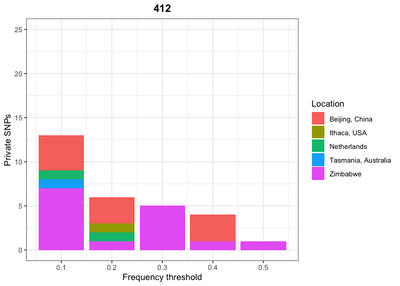
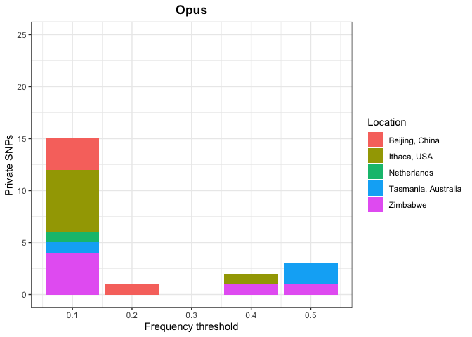
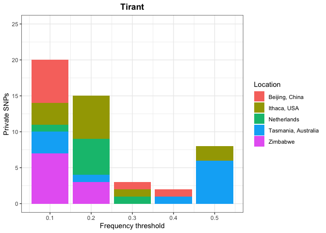
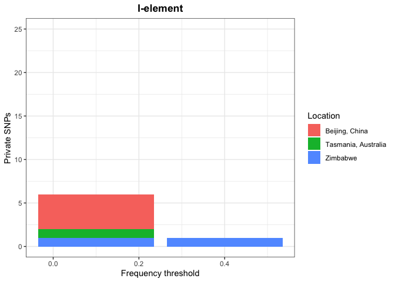
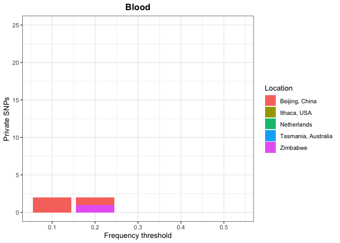
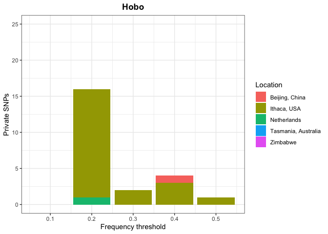

Private SNPS - Dmel Stealth Invasions
================

In this script I will try to detect the private SNPs for each population
that are driving the PCA. I want to confirm that the pattern shown by
UMAP and PCA is confirmed directly from the data. To filter the SNPs, I
used the script *mpileup2PCA.py* with low stringency (min-count 5,
min-freq 0.1) to call many SNPs to work on in this script.

## Metadata and data preparation

We focus on **GDL** samples, the same used in the UMAP/PCA.

``` r
library(tidyverse)
```

    ## ── Attaching core tidyverse packages ──────────────────────── tidyverse 2.0.0 ──
    ## ✔ dplyr     1.1.1     ✔ readr     2.1.4
    ## ✔ forcats   1.0.0     ✔ stringr   1.5.0
    ## ✔ ggplot2   3.4.2     ✔ tibble    3.2.1
    ## ✔ lubridate 1.9.2     ✔ tidyr     1.3.0
    ## ✔ purrr     1.0.1     
    ## ── Conflicts ────────────────────────────────────────── tidyverse_conflicts() ──
    ## ✖ dplyr::filter() masks stats::filter()
    ## ✖ dplyr::lag()    masks stats::lag()
    ## ℹ Use the conflicted package (<http://conflicted.r-lib.org/>) to force all conflicts to become errors

``` r
theme_set(theme_bw())

full_meta <- read_tsv("/Volumes/Temp1/Dmel-stealthTEs/preparation/dataset-metadata")
```

    ## Rows: 123 Columns: 8
    ## ── Column specification ────────────────────────────────────────────────────────
    ## Delimiter: "\t"
    ## chr (5): run_accession, sample, year, location, study
    ## dbl (3): lat, long, estimated_year
    ## 
    ## ℹ Use `spec()` to retrieve the full column specification for this data.
    ## ℹ Specify the column types or set `show_col_types = FALSE` to quiet this message.

``` r
meta_gdl <- full_meta %>% select(run_accession, location, study, estimated_year) %>% rename(ID = "run_accession") %>% filter(study=="gdl") %>% select(-study, -estimated_year)
```

Upload the .PCAable files produced using the script *mpileup2PCA.py* and
merging them with the metadata.

``` r
te412 <- read_tsv("/Volumes/Temp1/Dmel-stealthTEs/private-SNPs/412/cleaned.PCAable")
```

    ## Rows: 119 Columns: 178
    ## ── Column specification ────────────────────────────────────────────────────────
    ## Delimiter: "\t"
    ## chr   (1): ID
    ## dbl (177): 412_104, 412_115, 412_130, 412_137, 412_144, 412_146, 412_333, 41...
    ## 
    ## ℹ Use `spec()` to retrieve the full column specification for this data.
    ## ℹ Specify the column types or set `show_col_types = FALSE` to quiet this message.

``` r
te412$ID <- str_remove(te412$ID, "\\.cleaned$")
meta_412 <- inner_join(meta_gdl, te412, by="ID")

TIRANT <- read_tsv("/Volumes/Temp1/Dmel-stealthTEs/private-SNPs/tirant/cleaned.PCAable")
```

    ## Rows: 115 Columns: 962
    ## ── Column specification ────────────────────────────────────────────────────────
    ## Delimiter: "\t"
    ## chr   (1): ID
    ## dbl (961): TIRANT_23, TIRANT_26, TIRANT_128, TIRANT_137, TIRANT_151, TIRANT_...
    ## 
    ## ℹ Use `spec()` to retrieve the full column specification for this data.
    ## ℹ Specify the column types or set `show_col_types = FALSE` to quiet this message.

``` r
TIRANT$ID <- str_remove(TIRANT$ID, "\\.cleaned$")
meta_TIRANT <- inner_join(meta_gdl, TIRANT, by="ID")

BLOOD <- read_tsv("/Volumes/Temp1/Dmel-stealthTEs/private-SNPs/BLOOD/cleaned.PCAable")
```

    ## Rows: 115 Columns: 145
    ## ── Column specification ────────────────────────────────────────────────────────
    ## Delimiter: "\t"
    ## chr   (1): ID
    ## dbl (144): BLOOD_77, BLOOD_78, BLOOD_117, BLOOD_132, BLOOD_133, BLOOD_137, B...
    ## 
    ## ℹ Use `spec()` to retrieve the full column specification for this data.
    ## ℹ Specify the column types or set `show_col_types = FALSE` to quiet this message.

``` r
BLOOD$ID <- str_remove(BLOOD$ID, "\\.cleaned$")
meta_BLOOD <- inner_join(meta_gdl, BLOOD, by="ID")

OPUS <- read_tsv("/Volumes/Temp1/Dmel-stealthTEs/private-SNPs/OPUS/cleaned.PCAable")
```

    ## Rows: 115 Columns: 155
    ## ── Column specification ────────────────────────────────────────────────────────
    ## Delimiter: "\t"
    ## chr   (1): ID
    ## dbl (154): OPUS_98, OPUS_118, OPUS_135, OPUS_325, OPUS_366, OPUS_483, OPUS_5...
    ## 
    ## ℹ Use `spec()` to retrieve the full column specification for this data.
    ## ℹ Specify the column types or set `show_col_types = FALSE` to quiet this message.

``` r
OPUS$ID <- str_remove(OPUS$ID, "\\.cleaned$")
meta_OPUS <- inner_join(meta_gdl, OPUS, by="ID")

CIRC <- read_tsv("/Volumes/Temp1/Dmel-stealthTEs/private-SNPs/CIRC/cleaned.PCAable")
```

    ## Rows: 122 Columns: 518
    ## ── Column specification ────────────────────────────────────────────────────────
    ## Delimiter: "\t"
    ## chr   (1): ID
    ## dbl (517): CIRC_35, CIRC_40, CIRC_44, CIRC_50, CIRC_56, CIRC_58, CIRC_77, CI...
    ## 
    ## ℹ Use `spec()` to retrieve the full column specification for this data.
    ## ℹ Specify the column types or set `show_col_types = FALSE` to quiet this message.

``` r
CIRC$ID <- str_remove(CIRC$ID, "\\.cleaned$")
meta_CIRC <- inner_join(meta_gdl, CIRC, by="ID")

INVADER4 <- read_tsv("/Volumes/Temp1/Dmel-stealthTEs/private-SNPs/INVADER4/cleaned.PCAable")
```

    ## Rows: 122 Columns: 317
    ## ── Column specification ────────────────────────────────────────────────────────
    ## Delimiter: "\t"
    ## chr   (1): ID
    ## dbl (316): INVADER4_5, INVADER4_10, INVADER4_15, INVADER4_18, INVADER4_25, I...
    ## 
    ## ℹ Use `spec()` to retrieve the full column specification for this data.
    ## ℹ Specify the column types or set `show_col_types = FALSE` to quiet this message.

``` r
INVADER4$ID <- str_remove(INVADER4$ID, "\\.cleaned$")
meta_INVADER4 <- inner_join(meta_gdl, INVADER4, by="ID")

I <- read_tsv("/Volumes/Temp1/Dmel-stealthTEs/private-SNPs/I/cleaned.PCAable")
```

    ## Rows: 122 Columns: 607
    ## ── Column specification ────────────────────────────────────────────────────────
    ## Delimiter: "\t"
    ## chr   (1): ID
    ## dbl (606): DMIFACA_2, DMIFACA_16, DMIFACA_37, DMIFACA_39, DMIFACA_44, DMIFAC...
    ## 
    ## ℹ Use `spec()` to retrieve the full column specification for this data.
    ## ℹ Specify the column types or set `show_col_types = FALSE` to quiet this message.

``` r
I$ID <- str_remove(I$ID, "\\.cleaned$")
(meta_I <- inner_join(meta_gdl, I, by="ID"))
```

    ## # A tibble: 85 × 608
    ##    ID         location     DMIFACA_2 DMIFACA_16 DMIFACA_37 DMIFACA_39 DMIFACA_44
    ##    <chr>      <chr>            <dbl>      <dbl>      <dbl>      <dbl>      <dbl>
    ##  1 SRR1662283 Beijing, Ch…      1          0.97       0.4        0.71       0.47
    ##  2 SRR1663528 Beijing, Ch…      1          0.96       0.4        0.79       0.45
    ##  3 SRR1663529 Beijing, Ch…     -1          0.94       0.38       0.77       0.42
    ##  4 SRR1663530 Beijing, Ch…     -1          0.96       0.33       0.81       0.42
    ##  5 SRR1663531 Beijing, Ch…      1          0.92       0.39       0.77       0.43
    ##  6 SRR1663532 Beijing, Ch…      1          0.96       0.27       0.85       0.33
    ##  7 SRR1663533 Beijing, Ch…      0.68       0.92       0.41       0.78       0.44
    ##  8 SRR1663534 Beijing, Ch…      0.93       0.92       0.4        0.77       0.46
    ##  9 SRR1663535 Beijing, Ch…     -1          0.94       0.36       0.79       0.41
    ## 10 SRR1663536 Beijing, Ch…     -1          0.88       0.4        0.82       0.44
    ## # ℹ 75 more rows
    ## # ℹ 601 more variables: DMIFACA_46 <dbl>, DMIFACA_52 <dbl>, DMIFACA_53 <dbl>,
    ## #   DMIFACA_74 <dbl>, DMIFACA_102 <dbl>, DMIFACA_117 <dbl>, DMIFACA_129 <dbl>,
    ## #   DMIFACA_130 <dbl>, DMIFACA_131 <dbl>, DMIFACA_153 <dbl>, DMIFACA_158 <dbl>,
    ## #   DMIFACA_161 <dbl>, DMIFACA_164 <dbl>, DMIFACA_171 <dbl>, DMIFACA_215 <dbl>,
    ## #   DMIFACA_218 <dbl>, DMIFACA_219 <dbl>, DMIFACA_220 <dbl>, DMIFACA_226 <dbl>,
    ## #   DMIFACA_236 <dbl>, DMIFACA_245 <dbl>, DMIFACA_250 <dbl>, …

``` r
P <- read_tsv("/Volumes/Temp1/Dmel-stealthTEs/private-SNPs/P-element/cleaned.PCAable")
```

    ## Rows: 122 Columns: 2
    ## ── Column specification ────────────────────────────────────────────────────────
    ## Delimiter: "\t"
    ## chr (1): ID
    ## dbl (1): PPI251_31
    ## 
    ## ℹ Use `spec()` to retrieve the full column specification for this data.
    ## ℹ Specify the column types or set `show_col_types = FALSE` to quiet this message.

``` r
P$ID <- str_remove(P$ID, "\\.cleaned$")
(meta_P <- inner_join(meta_gdl, P, by="ID"))
```

    ## # A tibble: 85 × 3
    ##    ID         location       PPI251_31
    ##    <chr>      <chr>              <dbl>
    ##  1 SRR1662283 Beijing, China      0.18
    ##  2 SRR1663528 Beijing, China      0.29
    ##  3 SRR1663529 Beijing, China      0.19
    ##  4 SRR1663530 Beijing, China      0.23
    ##  5 SRR1663531 Beijing, China      0.17
    ##  6 SRR1663532 Beijing, China      0.06
    ##  7 SRR1663533 Beijing, China      0.16
    ##  8 SRR1663534 Beijing, China      0.21
    ##  9 SRR1663535 Beijing, China      0.17
    ## 10 SRR1663536 Beijing, China      0.27
    ## # ℹ 75 more rows

``` r
hobo <- read_tsv("/Volumes/Temp1/Dmel-stealthTEs/private-SNPs/hobo/cleaned.PCAable")
```

    ## Rows: 122 Columns: 424
    ## ── Column specification ────────────────────────────────────────────────────────
    ## Delimiter: "\t"
    ## chr   (1): ID
    ## dbl (423): DMHFL1_13, DMHFL1_20, DMHFL1_21, DMHFL1_28, DMHFL1_44, DMHFL1_46,...
    ## 
    ## ℹ Use `spec()` to retrieve the full column specification for this data.
    ## ℹ Specify the column types or set `show_col_types = FALSE` to quiet this message.

``` r
hobo$ID <- str_remove(hobo$ID, "\\.cleaned$")
(meta_hobo <- inner_join(meta_gdl, hobo, by="ID"))
```

    ## # A tibble: 85 × 425
    ##    ID       location DMHFL1_13 DMHFL1_20 DMHFL1_21 DMHFL1_28 DMHFL1_44 DMHFL1_46
    ##    <chr>    <chr>        <dbl>     <dbl>     <dbl>     <dbl>     <dbl>     <dbl>
    ##  1 SRR1662… Beijing…      0.99      0.98      0.99      0.95      0.98      0.95
    ##  2 SRR1663… Beijing…      0.99      0.98      0.98      0.92      0.97      0.91
    ##  3 SRR1663… Beijing…      0.99      0.99      0.99      0.92      0.99      0.91
    ##  4 SRR1663… Beijing…      0.99      0.98      0.99      0.94      0.98      0.93
    ##  5 SRR1663… Beijing…      0.98      0.96      0.97      0.86      0.97      0.86
    ##  6 SRR1663… Beijing…      0.99      0.98      0.99      0.92      0.98      0.9 
    ##  7 SRR1663… Beijing…      0.99      0.98      0.99      0.93      0.98      0.9 
    ##  8 SRR1663… Beijing…      1         0.98      0.99      0.97      0.99      0.97
    ##  9 SRR1663… Beijing…      0.99      0.99      0.98      0.9       0.98      0.87
    ## 10 SRR1663… Beijing…      1         0.98      0.97      0.89      0.96      0.85
    ## # ℹ 75 more rows
    ## # ℹ 417 more variables: DMHFL1_54 <dbl>, DMHFL1_55 <dbl>, DMHFL1_56 <dbl>,
    ## #   DMHFL1_61 <dbl>, DMHFL1_67 <dbl>, DMHFL1_70 <dbl>, DMHFL1_72 <dbl>,
    ## #   DMHFL1_87 <dbl>, DMHFL1_103 <dbl>, DMHFL1_104 <dbl>, DMHFL1_116 <dbl>,
    ## #   DMHFL1_117 <dbl>, DMHFL1_118 <dbl>, DMHFL1_119 <dbl>, DMHFL1_136 <dbl>,
    ## #   DMHFL1_137 <dbl>, DMHFL1_143 <dbl>, DMHFL1_150 <dbl>, DMHFL1_199 <dbl>,
    ## #   DMHFL1_201 <dbl>, DMHFL1_213 <dbl>, DMHFL1_215 <dbl>, DMHFL1_221 <dbl>, …

## Functions

Function which finds private SNPs in each population. Takes as input a
merged file (PCAable + metadata) and a frequency threshold (es. 0.5). It
counts how many SNPs are present in at least 50% of the individuals in a
population and not present in more than 15 other samples.

``` r
private <- function(data, threshold, percentage_pop_with_snp){
snps <- colnames(data)[3:length(colnames(data))]
populations <- data %>% select(location) %>% distinct() %>% pull()
private_snps <- tibble(location=NULL, SNP=NULL, thr=NULL, perc_shared_in_pop=NULL, number_external=NULL)

for (pop in populations){
  for (snp in snps){
    p <- data %>% select(ID, location, !!snp) %>% filter(location==pop)
    other <- filter(data, location!=pop)
    shared <- sum(p[[snp]] < threshold)
    count_pop <- p %>% summarise(count = n()) %>% pull()
    other_shared <- sum(other[[snp]] < threshold)
    if ((shared > (count_pop/100*percentage_pop_with_snp)) & other_shared<15){
      row <- tibble(location=pop, SNP=snp, thr=threshold, perc_shared_in_pop=shared/count_pop, number_external=other_shared)
      private_snps <- bind_rows(private_snps, row)
    }
  }
}
private_snps
}
```

Function to loop the function “private()” over multiple thresholds (from
0.5 to 0.9). A private SNP with 0.5 frequency is a very strong proof of
a bottleneck during the invasion, while a SNP with only 0.9 is not that
significant.

``` r
different_thresholds <- function(data, percentage_pop_with_snp){
result_tibble <- tibble(location=NULL, SNP=NULL, thr=NULL, perc_shared_in_pop=NULL, number_external=NULL)
for (t in seq(0.5, 0.9, +0.1)){
  tib <- private(data, t, percentage_pop_with_snp)
  result_tibble <- bind_rows(result_tibble, tib)
}
pops <- result_tibble %>% select(location) %>% distinct() %>% pull()
filtered_tibble <- tibble(location=NULL, SNP=NULL, thr=NULL, perc_shared_in_pop=NULL, number_external=NULL)
for (pop in pops){
  only_pop <- filter(result_tibble, location==pop)
  filtered <- only_pop %>% filter(thr==0.5)
for (t in seq(0.6, 0.9, +0.1)){
  th <- filter(only_pop, thr<t) %>% select(SNP) %>% pull()
  non_overlapping <- filter(only_pop, thr==t, !(SNP %in% th))
  filtered <- bind_rows(filtered, non_overlapping)
}
  filtered_tibble <- bind_rows(filtered_tibble, filtered)
}
filtered_tibble
}
```

Function which takes as input the tibble returned from
“different_thresholds” and creates a barplot.

``` r
private_plot <- function(data, titlee){
  plottable <- data %>% group_by(location, thr) %>% summarise(count = n()) %>% mutate(thr=1-thr)
  ggplot(plottable, aes(x = thr, y = count, fill = location)) +
  geom_bar(stat = "identity") +
  labs(x = "Frequency threshold", y = "Private SNPs", fill = "Location") +
  ggtitle(titlee) +
  theme(plot.title = element_text(hjust = 0.5, face = "bold")) +
  ylim(0,25) #+ xlim(0,0.6)
}
```

## Plots

Create the tibbles of private alleles with different frequency
thresholds for all the 4 interesting TEs.

``` r
(tib412 <- different_thresholds(meta_412, 50))
```

    ## # A tibble: 29 × 5
    ##    location SNP        thr perc_shared_in_pop number_external
    ##    <chr>    <chr>    <dbl>              <dbl>           <int>
    ##  1 Zimbabwe 412_7199   0.5              0.786               3
    ##  2 Zimbabwe 412_7168   0.6              0.643               0
    ##  3 Zimbabwe 412_115    0.7              0.786               2
    ##  4 Zimbabwe 412_1530   0.7              0.714               4
    ##  5 Zimbabwe 412_1536   0.7              0.714               5
    ##  6 Zimbabwe 412_1542   0.7              0.714               5
    ##  7 Zimbabwe 412_1554   0.7              0.571               4
    ##  8 Zimbabwe 412_1524   0.8              0.786              12
    ##  9 Zimbabwe 412_1476   0.9              0.571               8
    ## 10 Zimbabwe 412_1500   0.9              0.714               5
    ## # ℹ 19 more rows

``` r
(tib_BLOOD <- different_thresholds(meta_BLOOD, 50))
```

    ## # A tibble: 4 × 5
    ##   location       SNP          thr perc_shared_in_pop number_external
    ##   <chr>          <chr>      <dbl>              <dbl>           <int>
    ## 1 Beijing, China BLOOD_4216   0.8              0.733              10
    ## 2 Beijing, China BLOOD_267    0.9              0.8                 1
    ## 3 Beijing, China BLOOD_7278   0.9              0.6                 1
    ## 4 Zimbabwe       BLOOD_188    0.8              0.571              10

``` r
(tib_OPUS <- different_thresholds(meta_OPUS, 50))
```

    ## # A tibble: 21 × 5
    ##    location            SNP         thr perc_shared_in_pop number_external
    ##    <chr>               <chr>     <dbl>              <dbl>           <int>
    ##  1 Tasmania, Australia OPUS_325    0.5              0.778               4
    ##  2 Tasmania, Australia OPUS_7328   0.5              0.778               5
    ##  3 Tasmania, Australia OPUS_6383   0.9              0.889              11
    ##  4 Zimbabwe            OPUS_7369   0.5              0.714               0
    ##  5 Zimbabwe            OPUS_366    0.6              0.786               0
    ##  6 Zimbabwe            OPUS_4521   0.9              0.643              13
    ##  7 Zimbabwe            OPUS_4597   0.9              0.643              14
    ##  8 Zimbabwe            OPUS_4647   0.9              0.643              14
    ##  9 Zimbabwe            OPUS_4669   0.9              0.571              12
    ## 10 Ithaca, USA         OPUS_6385   0.6              0.842              14
    ## # ℹ 11 more rows

``` r
(tib_TIRANT <- different_thresholds(meta_TIRANT, 50))
```

    ## # A tibble: 48 × 5
    ##    location    SNP           thr perc_shared_in_pop number_external
    ##    <chr>       <chr>       <dbl>              <dbl>           <int>
    ##  1 Ithaca, USA TIRANT_5628   0.5              0.684               7
    ##  2 Ithaca, USA TIRANT_6757   0.5              0.632              13
    ##  3 Ithaca, USA TIRANT_2254   0.7              0.632               0
    ##  4 Ithaca, USA TIRANT_271    0.8              0.579               0
    ##  5 Ithaca, USA TIRANT_272    0.8              0.632               1
    ##  6 Ithaca, USA TIRANT_7005   0.8              0.789               0
    ##  7 Ithaca, USA TIRANT_7215   0.8              0.579               0
    ##  8 Ithaca, USA TIRANT_8235   0.8              0.526               1
    ##  9 Ithaca, USA TIRANT_8379   0.8              0.632               4
    ## 10 Ithaca, USA TIRANT_128    0.9              0.737               1
    ## # ℹ 38 more rows

``` r
(tib_I <- different_thresholds(meta_I, 50))
```

    ## # A tibble: 7 × 5
    ##   location            SNP            thr perc_shared_in_pop number_external
    ##   <chr>               <chr>        <dbl>              <dbl>           <int>
    ## 1 Zimbabwe            DMIFACA_3719   0.6              0.571               9
    ## 2 Zimbabwe            DMIFACA_3943   0.9              0.571              12
    ## 3 Beijing, China      DMIFACA_1013   0.9              0.6                 0
    ## 4 Beijing, China      DMIFACA_2143   0.9              0.667               0
    ## 5 Beijing, China      DMIFACA_3292   0.9              0.667               0
    ## 6 Beijing, China      DMIFACA_3708   0.9              0.667               0
    ## 7 Tasmania, Australia DMIFACA_161    0.9              0.556              13

``` r
#(tib_P <- different_thresholds(meta_P, 30))
(tib_hobo <- different_thresholds(meta_hobo, 50))
```

    ## # A tibble: 23 × 5
    ##    location    SNP           thr perc_shared_in_pop number_external
    ##    <chr>       <chr>       <dbl>              <dbl>           <int>
    ##  1 Ithaca, USA DMHFL1_1163   0.5              0.526               5
    ##  2 Ithaca, USA DMHFL1_1145   0.6              0.684              10
    ##  3 Ithaca, USA DMHFL1_1146   0.6              0.684              13
    ##  4 Ithaca, USA DMHFL1_1414   0.6              0.526              14
    ##  5 Ithaca, USA DMHFL1_1305   0.7              0.526              13
    ##  6 Ithaca, USA DMHFL1_1616   0.7              0.526              11
    ##  7 Ithaca, USA DMHFL1_1322   0.8              0.526              14
    ##  8 Ithaca, USA DMHFL1_1326   0.8              0.526              12
    ##  9 Ithaca, USA DMHFL1_1484   0.8              0.632              13
    ## 10 Ithaca, USA DMHFL1_1490   0.8              0.737              14
    ## # ℹ 13 more rows

``` r
#tib_CIRC <- different_thresholds(meta_CIRC, 50)
#tib_INVADER4 <- different_thresholds(meta_INVADER4, 50)
```

Plot the data.

``` r
(plot412 <- private_plot(tib412, "412"))
```

    ## `summarise()` has grouped output by 'location'. You can override using the
    ## `.groups` argument.

<!-- -->

``` r
(plotOPUS <- private_plot(tib_OPUS, "Opus"))
```

    ## `summarise()` has grouped output by 'location'. You can override using the
    ## `.groups` argument.

<!-- -->

``` r
(plotTIRANT <- private_plot(tib_TIRANT, "Tirant"))
```

    ## `summarise()` has grouped output by 'location'. You can override using the
    ## `.groups` argument.

<!-- -->

``` r
(plotI <- private_plot(tib_I, "I-element"))
```

    ## `summarise()` has grouped output by 'location'. You can override using the
    ## `.groups` argument.

<!-- -->

``` r
#(plotP <- private_plot(tib_P, "P-element"))
#(plotCIRC <- private_plot(tib_CIRC, "CIRC"))
#(plotINVADER4 <- private_plot(tib_INVADER4, "INVADER4"))

#ggsave("/Volumes/Temp1/Dmel-stealthTEs/private-SNPs/412.png", plot412, dpi = 300, width = 8, height = 6)
#ggsave("/Volumes/Temp1/Dmel-stealthTEs/private-SNPs/OPUS.png", plotOPUS, dpi = 300, width = 8, height = 6)
#ggsave("/Volumes/Temp1/Dmel-stealthTEs/private-SNPs/TIRANT.png", plotTIRANT, dpi = 300, width = 8, height = 6)
#ggsave("/Volumes/Temp1/Dmel-stealthTEs/private-SNPs/CIRC.png", plotCIRC, dpi = 300, width = 8, height = 6)
```

``` r
private_plot_BLOOD<- function(data, titlee){
  plottable <- data %>% group_by(location, thr) %>% summarise(count = n()) %>% mutate(thr=1-thr)
  add <- tibble(location=c("Netherlands", "Tasmania, Australia", "Ithaca, USA"), thr=c(0.3, 0.4, 0.5), count = 0)
  plottable <- bind_rows(plottable, add)
  ggplot(plottable, aes(x = thr, y = count, fill = location)) +
  geom_bar(stat = "identity") +
  labs(x = "Frequency threshold", y = "Private SNPs", fill = "Location") +
  ggtitle(titlee) +
  theme(plot.title = element_text(hjust = 0.5, face = "bold")) +
  ylim(0,25) #+ xlim(0,0.6)
}

(plotBLOOD <- private_plot_BLOOD(tib_BLOOD, "Blood"))
```

    ## `summarise()` has grouped output by 'location'. You can override using the
    ## `.groups` argument.

<!-- -->

``` r
ggsave("/Volumes/Temp1/Dmel-stealthTEs/private-SNPs/BLOOD.png", plotBLOOD, dpi = 300, width = 8, height = 6)

private_plot_HOBO<- function(data, titlee){
  plottable <- data %>% group_by(location, thr) %>% summarise(count = n()) %>% mutate(thr=1-thr)
  add <- tibble(location=c("Tasmania, Australia", "Zimbabwe"), thr=0.1, count = 0)
  plottable <- bind_rows(plottable, add)
  ggplot(plottable, aes(x = thr, y = count, fill = location)) +
  geom_bar(stat = "identity") +
  labs(x = "Frequency threshold", y = "Private SNPs", fill = "Location") +
  ggtitle(titlee) +
  theme(plot.title = element_text(hjust = 0.5, face = "bold")) +
  ylim(0,25) #+ xlim(0,0.6)
}
(plothobo <- private_plot_HOBO(tib_hobo, "Hobo"))
```

    ## `summarise()` has grouped output by 'location'. You can override using the
    ## `.groups` argument.

<!-- -->
