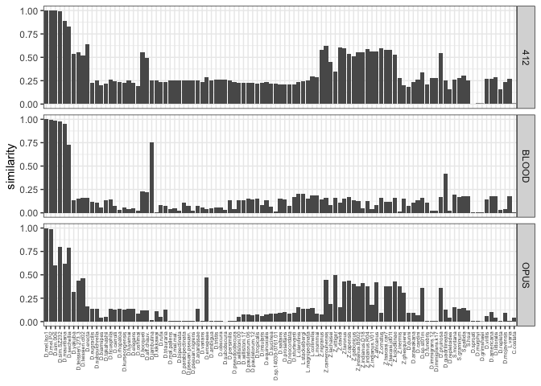
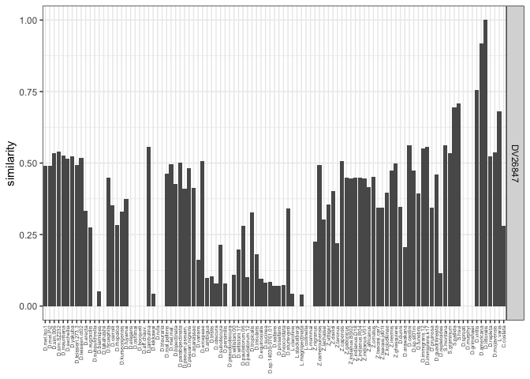
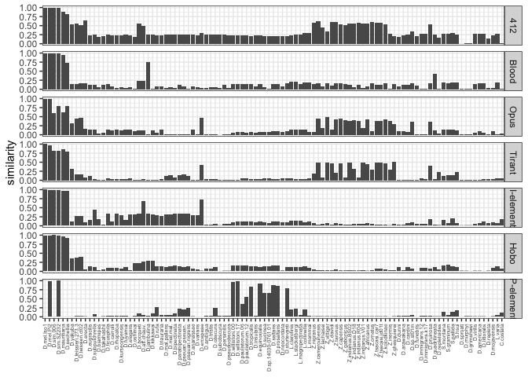

Origin of the TEs - visualization
================

# Compute the score for each TE and each species

``` bash
python process-101genomes.py --rm raw/merged-103.ori.out > te-species-score-103.txt
```

What is the script doing? For each TE find the maximum RM score. the
‘te\_max’ Than iterate over each species. Find for each te and species
the max ie ‘te\_species\_max’ than normalize to the total max: ‘score =
te\_species\_max/te\_max’

``` bash
head te-species-score-103.txt
#RT1C   D.sp.14030-0761.01  0.109682473847
#RT1C   D.erecta    0.356053274344
#RT1C   D.insularis 0.112862343887
#RT1C   D.ananassae 0.0810175584128
#RT1C   L.magnipectinata    0.136457901286
#RT1C   D.carrolli  0.0829070464077
#RT1C   D.yakuba    0.180515231117
#RT1C   D.teissieri.ct02    0.2704732937
#RT1C   D.littoralis    0.142034195124
#RT1C   D.willistoni.00 0.1042905203
```

-   col1: TE
-   col2: species
-   col3: score \[0-1\]; 1..high similarity to consensus sequence of TE
    in Dmel; 0..no similarity to cons.seq

# Visualize

## lets start with the three new ones: 412,opus,blood

lets set the sort order for all analysis

``` r
# order from https://elifesciences.org/articles/66405
# simulans complex: Dmel, Dsim, Dmau
#  Dmel group https://en.wikipedia.org/wiki/Drosophila_melanogaster_species_group
#  Dmel subgroup https://en.wikipedia.org/wiki/Drosophila_melanogaster_species_subgroup
sortorder<-c( 
      # melanogaster group
      "D.mel.Iso1","D.mel.Pi2","D.sim.006","D.sim.SZ232","D.mauritiana","D.sechellia", "D.yakuba", "D.teissieri.273.3","D.teissieri.ct02","D.erecta", # melanogaster subgroup
      "D.eugracilis", "D.subpulchrella", "D.biarmipes", "D.takahashii", "D.ficusphila", # several subroups
      "D.carrolli", "D.rhopaloa","D.kurseongensis", "D.fuyamai", #  rhopaloa subgroup
      "D.elegans", "D.oshimai", # elegans + suzuki subgroups
      "D.bocqueti","D.aff.chauv.","D.jambulina","D.kikkawai","D.rufa","D.triauraria", # montium subgroup
      "D.mal.pallens", "D.mal.mal.","D.bipectinata","D.parabipectinata","D.pseuan.pseuan.","D.pseuan.nigrens","D.ananassae","D.varians","D.ercepeae", # ananase subgroup
      # obscura group
      "D.ambigua","D.tristis", "D.obscura","D.subobscura", # obscura subgroup
      "D.persimilis", "D.pseudoobscura", # pseudoobscura subgroup
      # willistoni group 
      "D.willistoni.00","D.willistoni.17","D.paulistorum.06","D.paulistorum.12","D.tropicalis","D.insularis", "D.equinoxialis", # willistoni subgroup
      # saltans group
      "D.sucinea", "D.sp.14030-0761.01","D.saltans","D.prosaltans", # bocainensis + saltans subgroups
      "D.neocordata","D.sturtevanti", # neocordata + sturtevanti subgroup
      ### Lordiphosa (group?)
      "L.clarofinis", "L.stackelbergi","L.magnipectinata", # miki subgroup
      "L.collinella", "L.mommai", # fenestrarum + ? subgroup
      ### Zaprionus (group?)
      "Z.nigranus","Z.camerounensis","Z.lachaisei","Z.vittiger","Z.davidi","Z.taronus","Z.capensis", # vittiger subgroups
      "Z.gabonicus","Z.indianus.BS02","Z.indianus.D18","Z.indianus.R04","Z.indianus.V01","Z.africanus","Z.ornatus", # vittiger subgroup
      "Z.tsacasi.car7","Z.tsacasi.jd01t", # tuberculatus    subgroup
      "Z.kolodkinae", "Z.inermis","Z.ghesquierei", # inermis subgroup
      # D. cardini group
      "D.dunni","D.arawakana","D.cardini", # dunni + cardini subgroup
      # D. funebris group
      "D.sp.st01m","D.funebris",
      # D. immigrans group
      "D.immigrans.12","D.immigrans.k17","D.pruinosa","D.quadrilineata",
      # D. tumiditarsus group
      "D.repletoides",
      # Scaptomyza (group?)
      "S.montana","S.graminum","S.pallida","S.hsui",
      # Hawaiian Droso
      "D.sproati","D.murphyi","D.grimshawi",
      # D.virilis group
       "D.virilis","D.americana","D.littoralis",
      # D.repleta group
       "D.repleta","D.mojavensis",
      # genus Leucophengia
         "L.varia",
      # genus Chymomyza
      "C.costata"
   )
```

Now visualize

``` r
library(tidyverse)
```

    ## ── Attaching packages ─────────────────────────────────────── tidyverse 1.3.1 ──

    ## ✔ ggplot2 3.3.6     ✔ purrr   0.3.4
    ## ✔ tibble  3.1.7     ✔ dplyr   1.0.9
    ## ✔ tidyr   1.2.0     ✔ stringr 1.4.0
    ## ✔ readr   2.1.2     ✔ forcats 0.5.1

    ## ── Conflicts ────────────────────────────────────────── tidyverse_conflicts() ──
    ## ✖ dplyr::filter() masks stats::filter()
    ## ✖ dplyr::lag()    masks stats::lag()

``` r
theme_set(theme_bw())

h<-read.table("/Users/rokofler/analysis/dmel_TE_invasions/origin-101-genomes-ro-2/te-species-score-103.txt",header=F)
names(h)<-c("te","species","score")
h$spec <- factor(h$spec, levels=sortorder)

# the three new ones
t<-subset(h,te %in% c("OPUS","412","BLOOD"))

p<- ggplot(t,aes(y=score,x=spec))+geom_bar(stat="identity")+facet_grid(te~.)+ylab("similarity")+
  theme(axis.title.x=element_blank(),
        axis.text.x = element_text(angle = 90, vjust = 0.5, hjust=1,size=5))


plot(p)
```

<!-- -->

``` r
# the missed
t<-subset(h,te %in% c("DV26847"))

p<- ggplot(t,aes(y=score,x=spec))+geom_bar(stat="identity")+facet_grid(te~.)+ylab("similarity")+
  theme(axis.title.x=element_blank(),
        axis.text.x = element_text(angle = 90, vjust = 0.5, hjust=1,size=5))
plot(p)
```

<!-- -->

``` r
# all invaders
t<-subset(h,te %in% c("PPI251","DMHFL1","DMIFACA","TIRANT","OPUS","412","BLOOD"))
t$te<-factor(t$te, levels=c("412","BLOOD","OPUS", "TIRANT", "DMIFACA","DMHFL1","PPI251"))
levels(t$te) <- c('412', 'Blood', 'Opus',"Tirant","I-element","Hobo","P-element")


p<- ggplot(t,aes(y=score,x=spec))+geom_bar(stat="identity")+facet_grid(te~.)+ylab("similarity")+
  theme(axis.title.x=element_blank(),axis.text.x = element_text(angle = 90, vjust = 0.5, hjust=1,size=5))
plot(p)
```

<!-- -->

``` r
pdf(file="/Users/rokofler/analysis/dmel_TE_invasions/origin-101-genomes-ro-2/graphs/origin.pdf",width=7,height=7)
plot(p)
dev.off()
```

    ## quartz_off_screen 
    ##                 2
